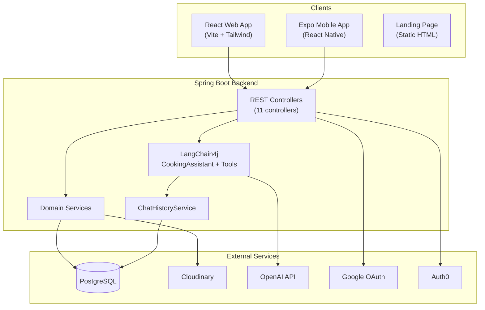

# CookCopilot — Project Status

**Last updated:** 2026-07-17  
**Scope:** Based on direct inspection of the codebase in `d:\dev\CookCopilot`

---

## 1. Project Overview

**CookCopilot** is a full-stack meal-planning application. It helps users:

- Track pantry inventory (quantities, units, ingredients)
- Manage recipes with folders, images, and ingredient lists
- Plan meals on a calendar
- Maintain a shopping list that syncs with pantry when items are checked off
- Get AI-assisted cooking help that can list recipes, create recipes, add items to the shopping list, and add/remove recipes from the meal plan

**Branding:** Web app and landing page use **CookCopilot** with the Warm Kitchen design system. Mobile app still shows legacy **ManageEat** / orange styling (not yet aligned).

The project consists of **four surfaces** sharing one backend:

| Surface | Path | Role |
|---------|------|------|
| Backend API | `backend/` | Spring Boot REST API, PostgreSQL, AI chat |
| Web app | `frontend/client/` | React + Vite SPA |
| Mobile app | `mobile/` | React Native + Expo |
| Landing page | `landing/` | Static marketing/waitlist page |

There is **no root monorepo config** — each subproject is largely self-contained. CI workflows live under `frontend/.github/workflows/`.

---

## 2. Tech Stack

### Backend (`backend`)

| Category | Technology |
|----------|------------|
| Language | Java 17 |
| Framework | Spring Boot 3.4.3 |
| Persistence | Spring Data JPA / Hibernate, PostgreSQL |
| Security | Spring Security, JWT (JJWT 0.12.6), OAuth2 (Google), Auth0 token login |
| AI | LangChain4j 1.0.0 + `langchain4j-open-ai-spring-boot-starter` 1.0.0-beta5 → OpenAI Chat Completions |
| Media | Cloudinary HTTP SDK 1.38.0 |
| Payments (dep only) | Stripe Java 28.2.0 — in `pom.xml`, not used in source |
| API docs | springdoc-openapi 2.8.6 (Swagger UI) |
| Config | `application.yml` + spring-dotenv (`.env` loading) |
| Build | Maven (`mvnw`) |
| Tests | JUnit, Spring Boot Test, H2 in-memory (`application-test.yml`); Testcontainers declared but unused |

**External APIs / services:** OpenAI, Cloudinary, Google OAuth, Auth0, Stripe (configured but unwired)

### Web Frontend (`frontend/client`)

| Category | Technology |
|----------|------------|
| Framework | React 18, TypeScript |
| Build | Vite 5 |
| Styling | Tailwind CSS 3.4 + Warm Kitchen tokens in `index.css` and `tailwind.config.js` |
| Icons | lucide-react |
| Auth | JWT in `localStorage`; Google OAuth via backend redirect |
| Images | browser-image-compression + Cloudinary upload API |
| Tests | Playwright (e2e, a11y via axe-core, visual regression) |
| Lint | ESLint, custom emoji-icon lint script |

**Note:** `react-router-dom` is in `package.json` but **not used** in the running app.

### Mobile (`mobile`)

| Category | Technology |
|----------|------------|
| Framework | React Native 0.81, Expo 54, React 19 |
| Navigation | `@react-navigation` (stack + bottom tabs) |
| Styling | NativeWind 4 (Tailwind for RN) |
| Auth | Email/password JWT + Auth0 (`react-native-auth0`, `expo-auth-session`) |
| Storage | `@react-native-async-storage/async-storage` |
| Images | `expo-image-picker` (local URIs only — no Cloudinary upload wired) |
| Payments (stub) | `react-native-iap` (mocked for Expo Go); `@stripe/stripe-react-native` (unused) |
| Tests | Jest 30 + jest-expo (auth API tests only) |
| Build | EAS (`eas.json`), bundle ID `com.pantry.app` |

### Landing Page (`landing`)

Static HTML/CSS/JS — Warm Kitchen styling, aligned with web app tokens. Waitlist form shows a client-side alert only.

### DevOps / CI

| Workflow | Target |
|----------|--------|
| `frontend/.github/workflows/frontend-azure-swa.yml` | Azure Static Web Apps — npm ci, emoji lint, Playwright e2e, Vite build |
| `frontend/.github/workflows/backend-azure-webapp.yml` | Azure Web App for backend |

---

## 3. Current Progress

### Backend — Working

- **Auth:** Email/password signup & signin, JWT issuance, Google OAuth2 redirect flow, Auth0 ID-token login, signout endpoint
- **Core CRUD:** Recipes, folders, ingredients (with bulk insert + search), pantry items (bulk insert/update), shopping list (bulk insert), meal plans, users
- **Meal planning logic:** Creating a meal plan compares recipe ingredients vs pantry and auto-adds shortfalls to the shopping list
- **Shopping list ↔ pantry sync:** Checking/unchecking items updates pantry quantities via `has_been_added_to_pantry` flag
- **Image upload:** Cloudinary upload/delete via `UploadController`
- **AI chat (LangChain4j):**
  - `POST /api/chat/send` — prompt guard, tool calling, structured response types
  - `GET /api/chat/history` — last 50 messages from DB
  - `GET /api/chat/actions` — lists available AI tools
  - Five `@Tool` methods in `CookingTools`: list recipes, add/remove from menu, create recipe, add to shopping list
  - Chat history persisted to `ai_messages` table; last 20 messages seeded into LangChain4j memory per request
- **Health & docs:** `GET /api/health`, Swagger UI at `/swagger-ui.html`
- **Tests:** 24 tests across 6 test classes — all chat-focused (controller, integration, tools, history)

### Web Frontend — Working

Nine active views switched via `currentView` state in `App.tsx`:

| View | Component | Status |
|------|-----------|--------|
| Login / SignUp | `Login.tsx`, `SignUp.tsx` | Email auth + Google OAuth work; Facebook is placeholder |
| Home | `Home.tsx` | Brand-first hero, primary AI CTA, secondary links below fold |
| AI Assistant | `AICookingAssistant.tsx` | Chat with history hydration, recipe/shopping-list/action cards |
| Calendar | `Calendar.tsx` | Meal plan month/list views, add/delete |
| Recipe Manager | `RecipeManager.tsx` | Folder-organized CRUD, image upload, ingredient autocomplete |
| Pantry Inventory | `PantryInventory.tsx` | Full CRUD with search |
| Shopping List | `ShoppingList.tsx` | Add/check/delete with pantry sync |
| Settings | `Settings.tsx` | Profile/units/theme UI (local state only) |

Layout: `Sidebar` (desktop) + `BottomNav` (mobile). Auth via `authContext`; data via `pantryContext`.

**Design system (Warm Kitchen):** Herb/linen palette, Fraunces + Source Sans 3. Tokens in `index.css` + `tailwind.config.js`. Master spec: `client/design-system/cookcopilot/MASTER.md`. Onboarding: root `README.md`.

**Chat LangChain4j migration:** 22/23 tasks complete per `tasks/chat-langchain4j-tools/progress.md` — only manual regression QA remains.

### Mobile — Working

Six bottom tabs (Home, Calendar, Pantry, Shopping, Recipes, Settings) plus stack screens for AI Assistant and Subscription. Core feature parity with web for meal planning, pantry, shopping, recipes, and AI chat (including history hydration).

### Landing Page — Working (static)

Marketing page with hero, features, and a non-functional waitlist form. Visual style matches web app (Warm Kitchen).

### Not Implemented / Schema Only

- **Subscription & billing:** DB entities (`Subscription`, `SubscriptionPlan`, `PlanEntitlement`, `Invoice`, `Payment`, `UsageQuota`) and repositories exist; no service, controller, or Stripe webhook integration
- **Usage quotas:** `UsageQuota.ai_message_sent` field exists but is not checked or incremented in chat flow
- **Token tracking:** `AIMessage.tokenIn` / `tokenOut` always stored as `0`
- **Structured recipe steps:** `Step` entity exists but is not used by current services (recipes use `@ElementCollection` for step strings)
- **Cooking history API:** Web has `api/history.ts` module but no backend controller; module is unused in UI

---

## 4. File Structure

```
CookCopilot/
├── backend/                 # Spring Boot API
│   ├── pom.xml                       # Maven dependencies
│   ├── schema.sql                    # DB schema + mock seed data
│   ├── gen_dtos.py                   # Python script that generated Java DTOs
│   ├── .env.example                  # Environment variable template
│   └── src/main/java/com/CookCopilot/
│       ├── CookCopilotApplication.java
│       ├── controller/               # 11 REST controllers (see §3)
│       ├── service/                  # Domain services + AI layer
│       │   ├── ai/CookingAssistant.java    # LangChain4j @AiServices interface
│       │   ├── CookingTools.java           # LangChain4j @Tool methods
│       │   ├── ChatHistoryService.java     # Persist/load chat messages
│       │   ├── ChatMemorySeeder.java       # Per-user message window memory
│       │   └── AuthService, RecipeService, … (8 domain services)
│       ├── config/
│       │   ├── SecurityConfig.java         # JWT filter, CORS, OAuth2
│       │   ├── LangChain4jConfig.java      # Wires CookingAssistant + tools
│       │   └── OAuth2LoginSuccessHandler.java
│       ├── entity/                   # 17 JPA entities
│       ├── repository/               # Spring Data repos
│       ├── dto/                      # Request/response DTOs (many generated)
│       └── common/GlobalExceptionHandler.java
│   └── src/test/                     # 6 test classes (chat only)
│
├── frontend/
│   ├── README.md                     # ⚠ Outdated (describes Node/MongoDB stack)
│   ├── .github/workflows/            # Azure CI for frontend + backend
│   ├── docs/                         # Design/feature docs
│   ├── tasks/                        # Design-system task tracker
│   └── client/                       # React web app
│       ├── package.json
│       ├── vite.config.js            # Dev proxy → localhost:8080
│       ├── playwright.config.ts      # E2e/a11y/visual test config
│       ├── e2e/                      # Playwright tests + snapshots
│       ├── design-system/cookcopilot/MASTER.md
│       └── src/
│           ├── App.tsx               # State-based view router
│           ├── index.css             # Warm Kitchen tokens + component utilities
│           ├── api/                  # REST client modules (12 files)
│           ├── components/           # 17 components (9 active + 4 orphaned + 4 shared)
│           ├── contexts/             # authContext, pantryContext
│           ├── hooks/                # useSearchIngredient
│           └── utils/                # imageHelper, recipeData (mock)
│
├── mobile/
│   ├── app.json                      # Expo config (Auth0, IAP plugins)
│   ├── eas.json                      # EAS build profiles
│   ├── jest.config.js
│   └── src/
│       ├── App.tsx                   # Navigation root
│       ├── navigation/               # Stack + tab navigators
│       ├── screens/                  # 11 screens
│       ├── api/                      # 10 REST client modules
│       ├── contexts/                 # authContext, pantryContext
│       └── services/iapService.ts    # Stubbed IAP for Expo Go
│
├── landing/
│   ├── index.html
│   ├── style.css
│   └── script.js
│
├── docs/                             # Architecture docs
│   └── Overall Project Structure.md  # ⚠ Partially outdated (Redis, raw OpenAI)
│
└── tasks/                            # Chat LangChain4j migration task tracker
    └── chat-langchain4j-tools/
```

### Key Backend Controllers

| Controller | Base path | Endpoints |
|------------|-----------|-----------|
| `AuthController` | `/api/auth` | signup, signin, signout, google-login, auth0 |
| `HealthController` | `/api` | health |
| `RecipeController` | `/api/recipe` | CRUD |
| `FolderController` | `/api/folder` | CRUD |
| `IngredientController` | `/api/ingredient` | CRUD + bulk |
| `PantryItemController` | `/api/pantry-item` | CRUD + bulk |
| `ShoppingListController` | `/api/shopping-list` | CRUD + bulk |
| `MealPlanController` | `/api/meal-plan` | CRUD |
| `UserController` | `/api/users` | CRUD |
| `UploadController` | `/api/upload` | image upload/delete |
| `ChatController` | `/api/chat` | send, history, actions |

### Key Frontend API Modules

| Module | Backend routes |
|--------|----------------|
| `api-auth.ts` | `/api/auth/*` |
| `recipes.ts` | `/api/recipe/*` |
| `folder.ts` | `/api/folder/*` |
| `ingredient.ts` | `/api/ingredient/*` |
| `pantryItem.ts` | `/api/pantry-item/*` |
| `shoppingList.ts` | `/api/shopping-list/*` |
| `mealPlan.ts` | `/api/meal-plan/*` |
| `chat.ts` | `/api/chat/send`, `/history`, `/actions` |
| `ImageUploader.ts` | `/api/upload/image` |

---

## 5. Known Issues

### Backend

| Issue | Detail |
|-------|--------|
| Stripe unused | Dependency and `app.stripe.secret-key` config exist; zero `com.stripe` imports in source |
| No subscription API | Entities/repos ready; no controller, service, or webhook handler |
| Usage quotas not enforced | `UsageQuota` entity exists; chat flow does not check or increment limits |
| Token counts not tracked | `AIMessage.tokenIn` / `tokenOut` always `0` |
| `Step` entity orphaned | Entity defined but services use `@ElementCollection` on `Recipe` instead |
| Test coverage gap | Only chat module tested; auth, recipes, pantry, shopping, meal plan untested |
| Testcontainers unused | Declared in `pom.xml` but no test uses it |
| Signout is client-side only | `GET /api/auth/signout` returns a message; no server-side token invalidation |

### Web Frontend

| Issue | Detail |
|-------|--------|
| Outdated README | `frontend/README.md` describes Node.js/Express/MongoDB |
| No URL routing | State-based `currentView`; no deep links, browser back/forward, or shareable URLs |
| `react-router-dom` dead dep | Installed but only referenced in unused `AppRouter.tsx` / `privateRoute.jsx` |
| `fetchAllRecipes` doesn't hydrate context | Returns data but never calls `setRecipes`; components use local state as workaround |
| `fetchAllMealPlans` same pattern | Returns data but never calls `setMealPlan`; `Calendar` uses local state |
| Settings not persisted | Profile, units, theme are local React state; `userSettings` in context never loaded from backend |
| Orphaned components | `QuickLog.tsx`, `RecipeSuggestions.tsx`, `RecipeCard.tsx`, `RecipeDetail.tsx` not mounted in `App.tsx` |
| `QuickLog` / `RecipeSuggestions` broken refs | Expect `addToCookingHistory` / `recipeSuggestions` on `pantryContext` — not defined |
| `history.ts` unused | API module for `/api/history` exists; no backend endpoint; never imported |
| Facebook login stub | `Login.tsx` / `SignUp.tsx` — `console.log` only |
| Forgot password non-functional | Link is `href="#"` |
| Theme toggle cosmetic | Settings theme radio doesn't apply CSS changes |
| Mobile UI not aligned | Web + landing use CookCopilot Warm Kitchen; mobile still ManageEat/orange |
| `googleClientContext.tsx` unused | Not wrapped in app; OAuth uses backend redirect instead |
| `@react-oauth/google` unused | In package.json but not imported |

### Mobile

| Issue | Detail |
|-------|--------|
| IAP fully stubbed | `iapService.ts` mocks products; `useSubscription()` always returns `isPro: false` |
| IAP init commented out | `App.tsx` line 35 — import commented for Expo Go |
| `subscriptionApi` unwired | Receipt validation endpoints defined but never called |
| No Cloudinary upload | Recipe images use local `file://` URIs in JSON; no upload API call |
| Google signup stubbed | `SignUpScreen.tsx` — TODO for expo-auth-session |
| Settings duplicate tab | Two "Theme" buttons both set `activeTab === 'appearance'` |
| User settings TODO | `pantryContext.tsx:315` — no backend API for settings |
| Folder delete TODO | `RecipeManagerScreen.tsx:266` — backend should move recipes to "Uncategorized" |
| Branding split | Mobile uses ManageEat/orange; web + landing use CookCopilot Warm Kitchen |
| Minimal test coverage | Only 2 auth test files; no screen/component tests |

### Landing Page

| Issue | Detail |
|-------|--------|
| Waitlist non-functional | Form shows alert; no API or email integration |
| Footer links are `#` placeholders | No links to web/mobile app |

### Documentation Drift

| Doc | Problem |
|-----|---------|
| `docs/Overall Project Structure.md` | Partially outdated — see root `README.md` for current stack summary |
| `frontend/README.md` | Describes wrong backend stack (Node/Mongo) |
| `frontend/docs/features/design-system-visual-alignment.md` | Describes superseded dark dashboard palette |

---

## 6. Next Tasks

Prioritized based on gaps visible in the code and existing task trackers.

### High Priority — Complete In-Progress Work

1. **Manual regression QA for chat LangChain4j migration** (`tasks/chat-langchain4j-tools/23-regression-verification.md`) — verify send/history/tools on web and mobile in a running environment; confirm rollback path
2. **Align mobile UI with Warm Kitchen** — mirror web tokens and CookCopilot branding on `mobile`
3. **Manual QA for Warm Kitchen UI** — all web views + landing at 375/768/1024 widths

### High Priority — Fix Broken / Incomplete Features

3. **Fix `pantryContext` fetch hydration** — `fetchAllRecipes` and `fetchAllMealPlans` should call `setRecipes` / `setMealPlan` so context state stays in sync
4. **Wire or remove orphaned web components** — either mount `RecipeSuggestions`/`QuickLog`/`RecipeDetail` with proper context support, or delete dead code
5. **Persist user settings** — add backend endpoint (or use existing `UserController`) and wire web + mobile Settings screens
6. **Mobile image upload** — integrate Cloudinary upload (mirror web `ImageUploader.ts`) instead of sending local URIs

### Medium Priority — Billing & Quotas

7. **Implement subscription backend** — `SubscriptionController`, Stripe webhook handler, wire `UsageQuota` enforcement in chat
8. **Wire mobile IAP** — uncomment IAP init, replace `iapService.ts` stubs, connect to `subscriptionApi` receipt validation
9. **Add web subscription UI** — mobile has `SubscriptionScreen`; web has none

### Medium Priority — Quality & Architecture

10. **Adopt URL routing on web** — replace `currentView` state with React Router; update Playwright navigation helpers
11. **Expand backend test coverage** — auth, recipe CRUD, pantry/shopping sync, meal plan auto-shopping-list logic
12. **Expand mobile test coverage** — screen tests for core flows
13. **Remove dead dependencies** — `@react-oauth/google`, unused `react-router-dom` (or wire it), `@stripe/stripe-react-native` on mobile if Stripe is backend-only
14. **Update outdated docs** — fix `frontend/README.md`; keep `docs/Overall Project Structure.md` in sync (root `README.md` is the fast onboarding entry)

### Lower Priority — Enhancements

15. **Implement cooking history** — backend controller for `/api/history`, wire web `history.ts` and `QuickLog` component
16. **Token usage tracking** — populate `AIMessage.tokenIn`/`tokenOut` from LangChain4j/OpenAI response metadata
17. **Landing page waitlist** — connect form to email service or backend endpoint
18. **Forgot password flow** — backend reset endpoint + frontend UI
19. **Server-side signout** — token blocklist or refresh-token rotation
20. **Streaming chat responses** — currently synchronous request/response only

---

## Architecture Diagram



---

## Test Summary

| Layer | Framework | Coverage |
|-------|-----------|----------|
| Backend | JUnit + Spring Boot Test | 24 tests — chat module only |
| Web | Playwright + axe-core | E2e, a11y (3 views), visual regression (36 baselines) |
| Mobile | Jest + jest-expo | 2 files — auth API + auth-helper only |
| Landing | None | — |

---

## Environment Variables (Backend)

Required via `.env` or shell:

`DB_HOST`, `DB_PORT`, `DB_NAME`, `DB_USERNAME`, `DB_PASSWORD`, `JWT_SECRET`, `FRONTEND_URL`, `CLOUDINARY_CLOUD_NAME`, `CLOUDINARY_API_KEY`, `CLOUDINARY_API_SECRET`, `OPENAI_API_KEY`, `OPENAI_MODEL`, `OPENAI_TEMPERATURE`, `OPENAI_MAX_TOKENS`, `AUTH0_DOMAIN`, `STRIPE_SECRET_KEY`, `CORS_ALLOWED_ORIGINS`, `PORT`, `GOOGLE_CLIENT_ID`, `GOOGLE_CLIENT_SECRET`

Web: `VITE_API_BASE_URL` (optional; Vite dev proxy handles `/api` locally)

Mobile: `EXPO_PUBLIC_API_BASE_URL`
