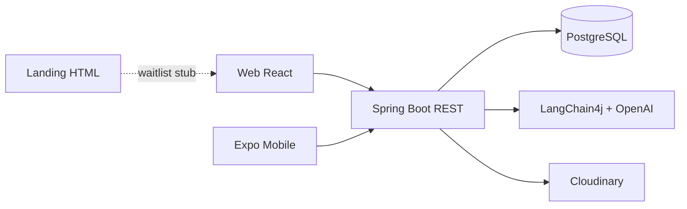

# LarderMind

**LarderMind** is a full-stack meal-planning app: track pantry inventory, plan meals on a calendar, manage recipes, sync a shopping list, and get AI cooking help that remembers your family's preferences.

This repo has **four surfaces** and **one shared backend**. There is no root monorepo tooling — each folder runs independently.

---

## Start here (5 minutes)

| If you want to… | Read this |
|-----------------|-----------|
| Understand what exists and what's broken | [PROJECT_STATUS.md](./PROJECT_STATUS.md) |
| See folder layout, APIs, and data model | [docs/Overall Project Structure.md](./docs/Overall%20Project%20Structure.md) |
| Run the backend locally | [backend/README.md](./backend/README.md) |
| Work on web UI / design tokens | [frontend/client/src/index.css](./frontend/client/src/index.css) + [design-system/cookcopilot/MASTER.md](./frontend/client/design-system/cookcopilot/MASTER.md) |
| Trace the AI chat feature | [docs/features/chat-langchain4j-tools.md](./docs/features/chat-langchain4j-tools.md) |

---

## Repo map

```
CookCopilot/
├── backend/          Spring Boot API (Java 17, PostgreSQL, LangChain4j)
├── frontend/client/  React + Vite web app
├── mobile/           React Native + Expo mobile app
├── landing/               Static marketing / waitlist page
├── docs/                      Architecture & feature docs
├── PROJECT_STATUS.md          Living status doc (features, gaps, next tasks)
└── tasks/                     Task trackers for larger migrations
```

---

## Quick run

### Docker (frontend + backend + Postgres)

```powershell
# From repo root — fill backend/.env first (see backend/.env.example)
docker compose up --build
```

- Web: `http://localhost:3000` (nginx proxies `/api` → backend)
- API: `http://localhost:8080`

Railway: deploy `backend/` and `frontend/client/` as two services (each has a `Dockerfile` + `railway.toml`). Set frontend build var `VITE_API_BASE_URL` to your backend public URL, and add that origin to backend `CORS_ALLOWED_ORIGINS`.

### Backend (port 8080)

```powershell
cd backend
# Copy .env.example → .env and fill in DB + API keys
.\mvnw.cmd spring-boot:run
```

Swagger UI: `http://localhost:8080/swagger-ui.html`

### Web app (port 5173)

```powershell
cd frontend/client
npm install
npm run dev
```

Vite proxies `/api` → `http://localhost:8080`. Optional: set `VITE_API_BASE_URL`.

### Mobile (Expo)

```powershell
cd mobile
npm install
npx expo start
```

Set `EXPO_PUBLIC_API_BASE_URL` to your backend URL (include `/api/` suffix).

### Landing page

Open `landing/index.html` in a browser — no build step.

---

## Domain in one pass

| Concept | What it means in this codebase |
|---------|--------------------------------|
| **Pantry** | Ingredients the user already has (`pantry_items`) |
| **Shopping list** | Items to buy; checking an item can add quantity to pantry |
| **Recipes** | User recipes in folders, with ingredients and instructions |
| **Meal plan** | Scheduled meals on a calendar; missing ingredients auto-added to shopping list |
| **AI assistant** | LangChain4j chat with tools: list recipes, create recipe, add to menu, add to shopping list |

Auth: email/password JWT, Google OAuth, Auth0. JWT stored in `localStorage` (web) or AsyncStorage (mobile).

---

## Brand & UI (web + landing)

Product name: **LarderMind** (web app and landing page).

Visual system — **Warm Kitchen**:

| Token | Value | Use |
|-------|-------|-----|
| `--ink` | `#1F2420` | Primary text |
| `--muted` | `#5E675F` | Secondary text |
| `--linen` | `#F3F0E8` | Page background |
| `--surface` | `#FAF8F3` | Raised panels |
| `--herb` | `#4F6B4A` | Accent / CTAs |
| `--sage` | `#D8E0D0` | Selected / soft tint |
| `--line` | `#DDD8CC` | Borders |

Fonts: **Fraunces** (display) + **Source Sans 3** (body).

Tailwind theme: `frontend/client/tailwind.config.js`  
Shared CSS utilities: `frontend/client/src/index.css` (`.btn-primary`, `.input-field`, `.page-title`)

**Note:** Mobile app (`mobile`) still uses the older ManageEat / orange styling — not yet aligned with Warm Kitchen.

---

## Web app navigation

The web app does **not** use URL routing today. Views are switched via `currentView` state in `App.tsx`:

`home` · `aiAssistant` · `calendar` · `pantryInventory` · `shoppingList` · `recipeManager` · `settings` · `login` · `signup`

Data layer: `authContext` (auth) + `pantryContext` (recipes, pantry, shopping, meal plans).

---

## Architecture



---

## Tests

| Layer | Command | Location |
|-------|---------|----------|
| Backend | `.\mvnw.cmd test` | `backend/` |
| Web e2e | `npm run test:e2e` | `frontend/client/` |
| Mobile | `npm test` | `mobile/` |

---

## Contributing pointers

- Prefer matching existing patterns in the file you're editing (naming, Tailwind usage, API modules under `src/api/`).
- Web styling: use design tokens (`text-herb`, `bg-linen`, etc.) — avoid hardcoding orange/red/gray utility classes.
- Large changes: check `PROJECT_STATUS.md` § Known Issues before duplicating known gaps.
- Do not trust `frontend/README.md` for stack info — it describes an old Node/Mongo setup.
