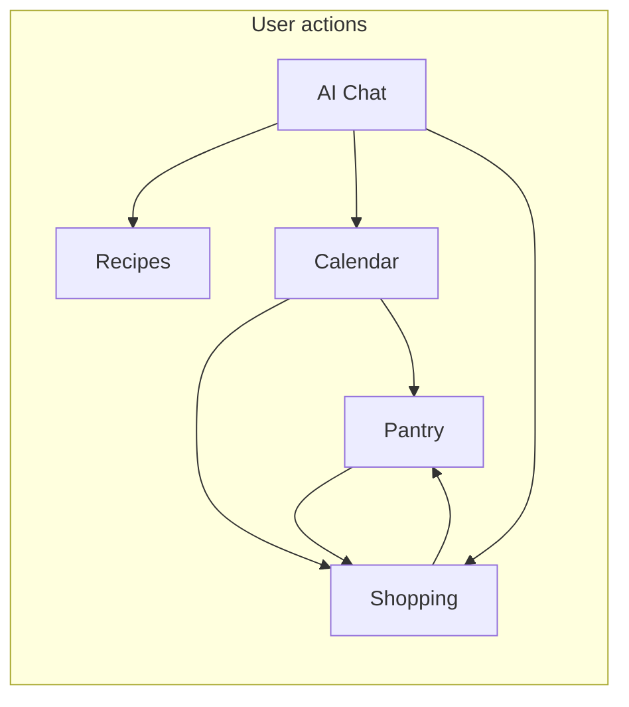
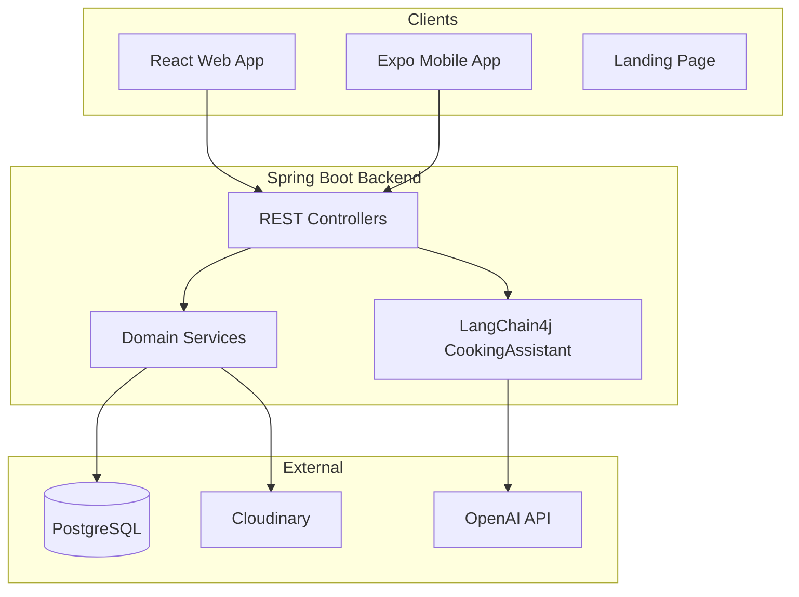

# CookCopilot Codebase Summary

> **Fast onboarding:** Start with [../README.md](../README.md), then [../PROJECT_STATUS.md](../PROJECT_STATUS.md) for gaps and next tasks.  
> **Last updated:** 2026-07-17

**CookCopilot** is a full-stack meal-planning application with three client surfaces, one static landing page, and one shared Java backend.

**Branding:** Web + landing = **CookCopilot** (Warm Kitchen UI). Mobile = legacy **ManageEat** / orange (not yet aligned).

---

## 1. Overall Project Structure

| Path | Purpose |
|------|---------|
| `backend/` | Spring Boot REST API (Java 17) |
| `frontend/client/` | React + Vite + TypeScript web app |
| `mobile/` | React Native + Expo mobile app |
| `landing/` | Static marketing page (`index.html`, `style.css`, `script.js`) |

**Key backend files:**
- `backend/pom.xml` — Maven dependencies
- `backend/src/main/java/com/CookCopilot/CookCopilotApplication.java` — entry point
- `backend/src/main/resources/application.yml` — config (PostgreSQL, OAuth, OpenAI, Stripe, Cloudinary)
- `backend/schema.sql` — DB schema + mock seed data

**Key frontend files:**
- `frontend/client/src/App.tsx` — view routing (state-based; no React Router in use)
- `frontend/client/src/contexts/pantryContext.tsx` — central data/state layer
- `frontend/client/src/api/` — REST client modules
- `frontend/client/src/index.css` — Warm Kitchen design tokens
- `frontend/client/design-system/cookcopilot/MASTER.md` — design spec

**Note:** `frontend/README.md` is **outdated** — it describes Node.js/Express/MongoDB. Use root `README.md` instead.

---

## 2. Backend

### Language & Framework
- **Java 17**, **Spring Boot 3.4.3**
- Spring Data JPA, Spring Security, OAuth2 client, validation, Web MVC
- Swagger/OpenAPI via `springdoc-openapi-starter-webmvc-ui`

### Primary dependencies
| Category | Packages |
|----------|----------|
| Core | `spring-boot-starter-web`, `data-jpa`, `security`, `oauth2-client`, `validation` |
| Auth | JJWT 0.12.6 |
| Database | PostgreSQL driver |
| AI | LangChain4j 1.0.0 + OpenAI starter |
| Media | Cloudinary HTTP SDK |
| Payments | Stripe Java (dependency only — not wired in source) |

### API Endpoints (JWT-protected except auth/health/swagger)

| Controller | Base Path | Endpoints |
|------------|-----------|-----------|
| `AuthController` | `/api/auth` | signup, signin, signout, google-login, auth0 |
| `HealthController` | `/api` | health |
| `RecipeController` | `/api/recipe` | CRUD |
| `ShoppingListController` | `/api/shopping-list` | CRUD + bulk |
| `PantryItemController` | `/api/pantry-item` | CRUD + bulk |
| `MealPlanController` | `/api/meal-plan` | CRUD |
| `IngredientController` | `/api/ingredient` | CRUD + bulk |
| `FolderController` | `/api/folder` | CRUD |
| `UserController` | `/api/users` | CRUD |
| `UploadController` | `/api/upload` | image upload/delete |
| `ChatController` | `/api/chat` | send, history, actions |

### Chat / AI (LangChain4j)
- `ChatController` — prompt guard, tool calling, structured responses
- `CookingAssistant` — LangChain4j `@AiServices` interface
- `CookingTools` — `@Tool` methods: list recipes, menu add/remove, create recipe, shopping list
- `ChatHistoryService` — persists to `ai_messages`; last 20 messages seeded into memory per request

See `docs/features/chat-langchain4j-tools.md` for full migration notes.

---

## 3. Frontend (Web)

### Framework & Stack
- **React 18** + **TypeScript** + **Vite 5**
- **Tailwind CSS 3.4** + Warm Kitchen tokens
- **lucide-react** icons
- Auth: JWT in `localStorage`; Google OAuth via backend redirect

### Design system (Warm Kitchen)
| Token | Value |
|-------|-------|
| Page background | `--linen` `#F3F0E8` |
| Accent / CTA | `--herb` `#4F6B4A` |
| Display font | Fraunces |
| Body font | Source Sans 3 |

Shared utilities: `.btn-primary`, `.input-field`, `.page-title` in `index.css`.

### Active views (`App.tsx` → `currentView`)
| View key | Component |
|----------|-----------|
| `home` | `Home.tsx` |
| `aiAssistant` | `AICookingAssistant.tsx` |
| `calendar` | `Calendar.tsx` |
| `pantryInventory` | `PantryInventory.tsx` |
| `shoppingList` | `ShoppingList.tsx` |
| `recipeManager` | `RecipeManager.tsx` |
| `settings` | `Settings.tsx` |
| `login` / `signup` | `Login.tsx`, `SignUp.tsx` |

Layout: `Sidebar` (desktop) + `BottomNav` (mobile).

### API modules (`client/src/api/`)
`chat.ts`, `recipes.ts`, `shoppingList.ts`, `pantryItem.ts`, `mealPlan.ts`, `ingredient.ts`, `folder.ts`, `api-auth.ts`, `client.ts`, `ImageUploader.ts`

---

## 4. Mobile App (`mobile`)

- **React Native 0.81** + **Expo 54** + **TypeScript**
- Navigation: `@react-navigation` (stack + bottom tabs)
- Styling: **NativeWind** — still legacy orange/ManageEat branding
- Mirrors web feature set with own `pantryContext` and API modules

**Screens:** Home, Calendar, Pantry, Shopping, Recipes, Settings, AI Assistant, Subscription, Login, SignUp

---

## 5. Landing Page (`landing/`)

Static HTML/CSS — Warm Kitchen tokens aligned with web app. Waitlist form is client-side alert only (no backend).

---

## 6. Database

### Primary: **PostgreSQL**
- JPA/Hibernate with `ddl-auto: update`
- Env: `DB_HOST`, `DB_PORT`, `DB_NAME`, `DB_USERNAME`, `DB_PASSWORD`

### Key entities
| Entity | Purpose |
|--------|---------|
| `User` | Auth (email, Google, Auth0) |
| `Recipe`, `Folder`, `RecipeIngredient` | Recipes |
| `Ingredient` | Global ingredient catalog |
| `PantryItem` | User pantry stock |
| `ShoppingListItem` | Shopping list + pantry sync flags |
| `MealPlan` | Scheduled meals |
| `AIMessage` | Chat history (persisted) |
| `Subscription`, `UsageQuota`, etc. | Billing schema — mostly unwired |

---

## 7. Domain flows (how pieces connect)

| Flow | Behavior |
|------|----------|
| Meal plan → shopping | `MealPlanService` compares recipe ingredients vs pantry; adds shortfalls to shopping list |
| Shopping check → pantry | Checking an item adds quantity to pantry; `has_been_added_to_pantry` prevents double-sync |
| AI chat → actions | Tools can create recipes, modify meal plan, add shopping items |

---

## 8. Architecture

---

## Notable observations

1. **Mature core features** — pantry, recipes, shopping, calendar, AI chat work end-to-end on web and mobile.
2. **Subscription/billing** — DB entities exist; no backend controller; mobile IAP stubbed.
3. **Web has no URL routing** — `currentView` state only; no deep links.
4. **Mobile UI drift** — branding and colors not yet matched to Warm Kitchen.
5. **Orphaned web components** — `QuickLog`, `RecipeSuggestions`, `RecipeDetail` exist but are not mounted in `App.tsx`.

For known bugs and prioritized next tasks, see [../PROJECT_STATUS.md](../PROJECT_STATUS.md).
