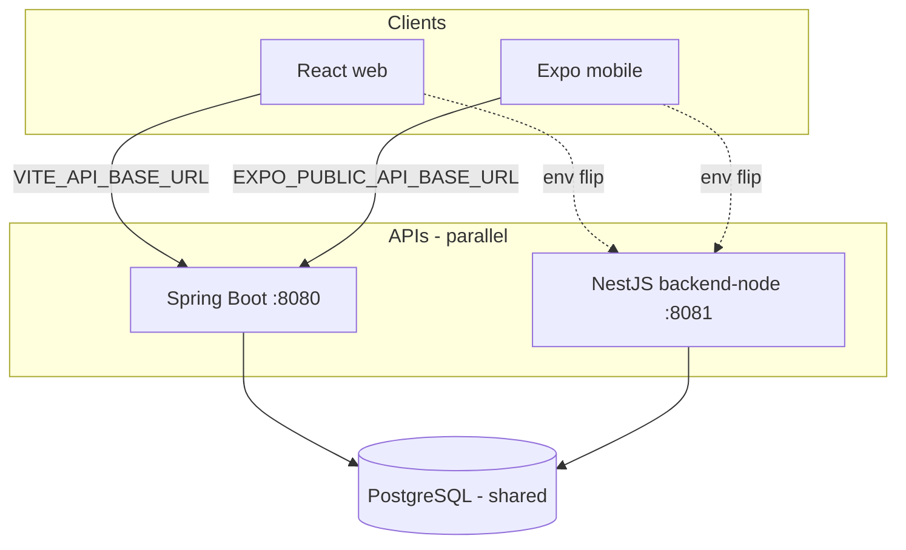
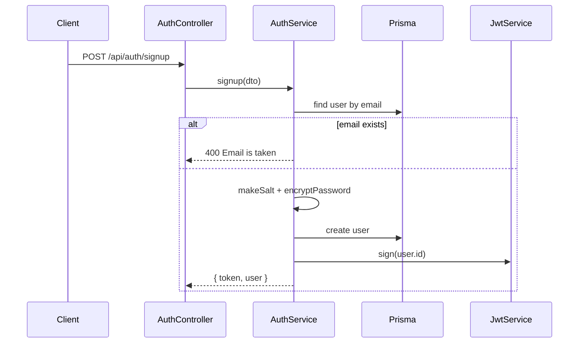

# Technical Design: Backend Migration – NestJS (`backend-node/`)

**Feature reference:** [backend-node-migration.md](../features/backend-node-migration.md)  
**Status:** Design  
**Scope:** Wave 1 (auth + health + core CRUD) + scaffolding for Wave 1.5 / Wave 2  
**Output path note:** Repo uses `docs/design/` (not `docs/designs/`).

---

## 1. Overview

Add a **NestJS + Prisma + TypeScript** API in `backend-node/` that speaks the **same HTTP contract** as Spring Boot `backend/`, runs on **port 8081** in parallel, and shares the same PostgreSQL database and env var names.

### Goals

| Goal | How achieved |
|------|--------------|
| **Client-zero-change** | Identical paths, `ApiResponse` envelope, snake_case `@JsonProperty` fields, JWT `user_id` claim |
| **Spring property inheritance** | Same env names as `backend/.env.example` / `application.yml` |
| **Safe parallel run** | Separate process/port; Prisma client-only (no DDL ownership yet) |
| **Incremental migration** | Wave 1 CRUD → Wave 1.5 meal confirm/skip → Wave 2 chat/upload/subscription |
| **Spring-like structure** | Nest modules ≈ Spring packages; guards ≈ filters; DI ≈ `@Service` |

### Non-goals (Wave 1)

- LangChain.js chat / SSE
- Cloudinary upload
- Stripe + full entitlement engine
- Prisma migrate against shared prod while Hibernate `ddl-auto: update` is on
- Replacing Spring in docker-compose / Railway as primary
- Meal-plan **confirm / skip / pending-confirm** (→ **Wave 1.5**)

---

## 2. Locked decisions (from requirements §9)

| # | Topic | **Locked decision** |
|---|--------|---------------------|
| 1 | Password | **HMAC-SHA1** with per-user `salt`; output **lowercase hex**. Byte-compatible with Spring `AuthService`. No bcrypt upgrade in Wave 1 (tech debt documented). |
| 2 | JWT | **HS256**, claim **`user_id`** (UUID string), **`iat`**, **no `exp`**. Shared `JWT_SECRET` (≥ 256 bits). Tokens interchangeable with Spring. |
| 3 | Meal confirm/skip | **Wave 1.5**. Wave 1 = meal-plan CRUD only. Clients needing confirm/skip stay on Spring until 1.5. |
| 4 | Users API | **Full Spring parity**: any authenticated user may list/get/update/delete any user (no self-only hardening in Wave 1). |
| 5 | Prisma ownership | **Introspect / hand-map + client only**. No Prisma migrate on shared DB until Spring `ddl-auto` → `validate`/`none` or Spring retired. |

---

## 3. Architecture overview

### 3.1 Where it fits



### 3.2 Nest module map (Wave 1)

```
backend-node/
├── prisma/
│   └── schema.prisma          # introspected / hand-mapped; no migrate push in Wave 1
├── src/
│   ├── main.ts
│   ├── app.module.ts
│   ├── config/                # env validation (same names as Spring)
│   ├── common/
│   │   ├── api-response.ts
│   │   ├── filters/http-exception.filter.ts
│   │   └── interceptors/      # optional transform helpers
│   ├── prisma/                # PrismaModule + PrismaService
│   ├── auth/
│   ├── health/
│   ├── users/
│   ├── user-preferences/
│   ├── folders/
│   ├── recipes/
│   ├── ingredients/
│   ├── pantry-items/
│   ├── shopping-list/
│   └── meal-plans/            # CRUD only in Wave 1
├── .env.example               # clone of backend/.env.example + PORT=8081 note
├── package.json
├── tsconfig.json
└── README.md
```

Spring → Nest mapping:

| Spring | Nest |
|--------|------|
| `@RestController` | Controller in feature module |
| `@Service` | Injectable service |
| `JwtAuthenticationFilter` | `JwtAuthGuard` + passport-jwt or custom guard |
| `Authentication.getPrincipal()` → UUID | `@CurrentUser()` decorator → `userId: string` |
| `GlobalExceptionHandler` | `HttpExceptionFilter` mapping to `ApiResponse` |
| `ApiResponse<T>` | `ApiResponse<T>` helper |
| JPA repositories | Prisma client methods in services |

### 3.3 Request pipeline

```
HTTP → CORS → ValidationPipe → JwtAuthGuard (unless @Public)
     → Controller → Service → Prisma → ApiResponse / bare health
```

Public routes (match `SecurityConfig`):

- `GET /api/health`
- `/api/auth/**`

All other Wave 1 routes require `Authorization: Bearer <jwt>`.

---

## 4. Data models / schema

### 4.1 Strategy

1. Start from `backend/schema.sql` + Spring entities.
2. Generate/maintain `prisma/schema.prisma` via **`prisma db pull`** against local/dev DB when available; otherwise hand-map Wave 1 tables.
3. `PrismaService` uses `DATABASE_URL` built from `DB_*` env vars (see §7.1).
4. **No** `prisma migrate deploy` on shared environments in Wave 1.

### 4.2 Wave 1 tables (read/write)

| Table | Notes |
|-------|--------|
| `users` | Auth + `/api/users` |
| `user_preferences` + allergy/dislike/like/dietary join tables | Preferences module |
| `folders` | Scoped by `user_id` |
| `recipes` | Scoped by `user_id`; image fields nullable |
| `recipe_ingredients` | Nested under recipe |
| `steps` | If Spring still uses for instructions — match RecipeService resolve logic |
| `ingredients` | Global catalog + bulk |
| `pantry_items` | Scoped by `user_id` |
| `shopping_list_items` | Scoped by `user_id`; may create zero-qty pantry row (Spring behavior) |
| `meal_plans` | CRUD; status enum string parity |

### 4.3 Deferred tables (present in Prisma optional / unused)

`ai_messages`, subscription/billing (`subscriptions`, `usage_quotas`, …), `inventory_audit_logs` (needed in **Wave 1.5** confirm), etc.

### 4.4 No new tables in Wave 1

Schema remains Spring/Hibernate-owned.

### 4.5 Timestamps

Spring uses **unix seconds** (`created_at` / `updated_at` BIGINT). Prisma models must use `BigInt` (or map carefully) — not JS `Date` columns — to avoid type drift.

### 4.6 UUID

All ids are UUID; Nest services use string UUID; JSON serializes as string (same as Spring).

---

## 5. Interface design

### 5.1 Envelope

```typescript
type ApiResponse<T> = {
  success: boolean;
  message: string;
  data?: T; // omitted when undefined (match Jackson NON_NULL)
};
```

Helpers: `ok(data, message = 'OK')`, `fail(message)`.

**Health exception:** `GET /api/health` → `{ status: 'UP', timestamp: number }` with **no** envelope.

### 5.2 JSON naming

Preserve Spring `@JsonProperty` snake_case on wire:

| Examples | Wire name |
|----------|-----------|
| firstName | `first_name` |
| lastName | `last_name` |
| mealName | `meal_name` |
| folderId | `folder_id` |
| recipeId | `recipe_id` |
| mealType | `meal_type` |
| servingDate | `serving_date` |
| ingredientId | `ingredient_id` |

Use `class-validator` + `class-transformer` with `@Expose` / `@Transform` or explicit DTO `@ApiProperty` aliases. Prefer **explicit DTO classes** over global snake_case rename (avoids breaking fields that are already camelCase on wire, e.g. `email`, `token`, `instructions`).

### 5.3 Auth endpoints

| Method | Path | Request | Response `data` |
|--------|------|---------|-----------------|
| POST | `/api/auth/signup` | `{ first_name, last_name, email, password }` | `{ token, user }` |
| POST | `/api/auth/signin` | `{ email, password }` | `{ token, user }` |
| GET | `/api/auth/signout` | — | `{ message: "signed out" }` shape per `SignoutResponse` |
| POST | `/api/auth/google-login` | `{ token }` | `{ token, user }` |
| POST | `/api/auth/google-callback` | form `credential` | **302** redirect to `FRONTEND_URL/#google_auth=<base64url>` or `#google_auth_error=` |

`user` in auth responses: `{ id, email, firstName→ first_name?, … }` — match Spring `UserDto` JSON exactly (verify with one Spring response dump during implementation; include `name` when Spring does).

### 5.4 CRUD endpoints (parity)

Mirror Spring controllers under:

- `/api/users` — list, get, put, delete (no ownership check beyond “authenticated”)
- `/api/user-preferences` — get, put (current user)
- `/api/folder` — CRUD
- `/api/recipe` — CRUD
- `/api/ingredient` — CRUD + `POST /bulk`
- `/api/pantry-item` — CRUD + `POST /bulk`, `PUT /bulk`
- `/api/shopping-list` — CRUD + `POST /bulk`
- `/api/meal-plan` — `GET`, `GET /:id`, `POST`, `PUT /:id`, `DELETE /:id` only

**Wave 1.5 adds:** `GET /pending-confirm`, `POST /:id/confirm`, `POST /:id/skip`.

### 5.5 HTTP status mapping

| Condition | Status | Body |
|-----------|--------|------|
| Success | 200 | `ApiResponse` success (or bare health) |
| Validation / business bad input | 400 | `{ success: false, message }` |
| Missing/invalid JWT on protected route | 401 | `{ success: false, message }` |
| Not found | 404 | `{ success: false, message }` |
| Unhandled | 500 | `{ success: false, message }` (no stack in prod) |

Match Spring message strings where clients may display them, e.g.:

- `"Email is taken"`
- `"User not found"`
- `"Email and password don't match."`

### 5.6 Core function signatures (illustrative)

```typescript
// auth.service.ts
signup(dto: SignupRequest): Promise<SignupResponse>;
signin(dto: SigninRequest): Promise<SigninResponse>;
googleLogin(idToken: string): Promise<GoogleLoginResponse>;

// crypto (password.util.ts) — must match Spring
makeSalt(): string;
encryptPassword(password: string, salt: string): string; // HMAC-SHA1 hex
authenticate(plain: string, salt: string, hash: string): boolean;

// jwt.service.ts
sign(userId: string): string;           // claim user_id, iat, HS256, no exp
verify(token: string): { userId: string };
```

Password Nest reference implementation:

```typescript
import { createHmac } from 'crypto';

export function encryptPassword(password: string, salt: string): string {
  if (!password) return '';
  return createHmac('sha1', salt).update(password, 'utf8').digest('hex');
}
```

(`createHmac` key is string → UTF-8; matches Java `salt.getBytes(UTF_8)`.)

---

## 6. Business logic flows

### 6.1 Email signup / signin



Signin: load by email → HMAC verify → JWT. Fail messages match Spring.

### 6.2 Google login

1. Reject non-JWT (must contain exactly two `.`).
2. Verify ID token with `google-auth-library` (or equivalent), audience = `GOOGLE_CLIENT_ID`.
3. Require `email_verified`.
4. Find by `google_id` → else find by email and link `google_id` → else create user (random password HMAC like Spring).
5. Return `{ token, user }`.

**Callback:** same verify path; build JSON `{ token, user }` with non-ASCII escaped if needed; Base64URL (no padding); redirect `FRONTEND_URL/#google_auth=...`. On failure → `#google_auth_error=<urlencoded>`.

CORS for `/api/auth/google-callback`: allow all origins for POST/OPTIONS only (Spring special-case).

### 6.3 Authenticated CRUD (typical owned resource)

1. Guard extracts `user_id` from JWT → request context.
2. List/create pass `userId` into Prisma `where` / `data`.
3. Get/update/delete by id: match Spring — some Spring getters do **not** re-check ownership (e.g. folder getById). **Parity first:** replicate Spring service checks as-is; do not silently tighten.

### 6.4 Recipe create (Wave 1 simplifications)

Spring also calls `UsageQuotaService.checkRecipeCreation` and `StockImageService`.

| Concern | Wave 1 Nest design |
|---------|-------------------|
| Recipe count quota | **Thin port:** read `app.subscription.free.max-recipes` (50) from config; if recipe count ≥ limit and not unlimited, return **402** with same quota message shape when feasible. Full entitlement/Stripe = Wave 2. If entitlement tables missing locally, fall back to free limits from env/config only. |
| Stock image | If client omits `image`, leave null in Wave 1 (skip Unsplash). Document divergence; optional follow-up task. |
| Ingredients | Upsert/link ingredient rows like Spring `saveRecipeIngredient` + unit helpers — port `UnitConverter` / `IngredientLineParser` logic as TS utils where required for parity. |

### 6.5 Shopping list create

Port Spring behavior: resolve ingredient, convert units, ensure pantry row exists (qty 0 if missing), set shopping flags. Exact field names from Spring maps/DTOs.

### 6.6 Meal plan Wave 1 vs 1.5

- **Wave 1:** create/list/get/update/delete rows; return DTO with `meal_name` joined from recipe when Spring does.
- **Wave 1.5:** pending-confirm list, confirm (pantry deduction + inventory audit), skip, and any auto-skip on list/read that Spring performs — port `MealPlanService` side effects carefully.

---

## 7. Configuration (inherit Spring properties)

### 7.1 Env contract

Load via `@nestjs/config` + Zod/Joi schema. Required for Wave 1 boot:

`DB_HOST`, `DB_PORT`, `DB_NAME`, `DB_USERNAME`, `DB_PASSWORD`, `DB_SSL_MODE`, `JWT_SECRET`, `GOOGLE_CLIENT_ID`, `FRONTEND_URL`, `CORS_ALLOWED_ORIGINS`, `PORT` (default **8081**).

Optional / declared for later: LLM, Stripe, Cloudinary, Unsplash, YouTube, social import, pool sizes.

Build Prisma URL:

```
postgresql://{DB_USERNAME}:{DB_PASSWORD}@{DB_HOST}:{DB_PORT}/{DB_NAME}?sslmode={DB_SSL_MODE}
```

For Supabase transaction pooler, append Prisma-friendly params as needed (e.g. `pgbouncer=true` / disable prepared statements) — document in README after first pooler test.

Apply `DB_POOL_SIZE` / `DB_POOL_MIN_IDLE` via Prisma connection limit where supported.

### 7.2 Subscription config (thin)

Mirror YAML defaults in config module:

- free: `ai-messages-per-day: 20`, `max-recipes: 50`, …
- pro: …  
Used only for thin recipe-limit check in Wave 1.

---

## 8. Edge cases & error handling

| Case | Handling |
|------|----------|
| Duplicate email | 400 `"Email is taken"` |
| Bad password | 400 `"Email and password don't match."` |
| Unknown email | 400 `"User not found"` (Spring signin) |
| Invalid Google token | 400 with Spring-equivalent messages |
| Google not configured | 400 `"Google login is not configured on the server"` |
| No/invalid Bearer on protected route | 401 |
| Resource missing | 404 `"… not found"` per Spring |
| Empty bulk array | 400 or empty success — **match Spring controller validation** |
| Prisma unique violation | Map to 400, not 500 |
| Boot missing `JWT_SECRET` | Process exit with clear log |

Global filter must not leak SQL / Prisma meta to clients in production.

---

## 9. Performance & security

### Performance

- Small pool (inherit `DB_POOL_SIZE`, default 2).
- Recipe list: batch-load ingredients (avoid N+1) like Spring `getIngredientsForRecipes`.
- No SQL query logging by default.
- Lazy-load Wave 2 modules later (not registered in Wave 1 `AppModule`).

### Security

- HMAC-SHA1 passwords: document as known weak; Wave 1 compatibility > upgrade.
- JWT: no `exp` (matches Spring); plan coordinated expiry later.
- CORS allow-list from `CORS_ALLOWED_ORIGINS`; credentials true; google-callback exception.
- Never log passwords or full tokens.
- Users API remaining wide-open is **intentional parity**; harden both backends in a separate task.
- UTF-8 throughout (Express JSON + redirects).

---

## 10. Testing strategy

| Layer | Coverage |
|-------|----------|
| Unit | `encryptPassword` / `authenticate` golden vectors vs known Spring samples; JWT sign/verify round-trip; one folder/recipe service with mocked Prisma |
| Integration | Health; signup→signin→JWT→create folder→list; optional Testcontainers Postgres or docker compose `db` |
| Manual | Point web `VITE_API_BASE_URL` to `:8081`; login + pantry/recipe smoke |

CI (later): `npm run lint && npm run test && npm run build`.

---

## 11. Wave plan (implementation boundaries)

| Wave | Deliverable |
|------|-------------|
| **1** | Scaffold, config, Prisma client, auth, health, users, preferences, folders, recipes, ingredients, pantry, shopping, meal-plan CRUD |
| **1.5** | Meal-plan pending/confirm/skip + pantry deduction + inventory audit |
| **2** | Chat + LangChain.js tools, upload/Cloudinary, subscription/Stripe, recipe import, stock images, compose/Railway primary cutover |

---

## 12. Conflicts & alternatives

| Topic | Conflict | Decision |
|-------|----------|----------|
| Password strength | HMAC-SHA1 is weak | Keep for compatibility; backlog: dual-hash migrate |
| JWT no expiry | Security vs parity | Keep no `exp` until both backends change |
| Recipe quota without Stripe | Entitlement incomplete | Thin free-tier max-recipes from config |
| Stock images | Spring may fill Unsplash | Wave 1 omit auto-stock; document |
| Folder getById without user check | IDOR risk | Parity with Spring; harden later both sides |
| Template path `docs/designs/` | Repo uses `docs/design/` | This file lives under `docs/design/` |

---

## 13. Acceptance criteria (design → implementation)

1. Design locks §2 decisions (done).
2. Implementers can scaffold Nest from §3.2 without inventing new env names.
3. Auth crypto + JWT specified enough for byte/token compatibility tests.
4. Wave 1 endpoint set excludes confirm/skip; Wave 1.5 explicitly owns them.
5. Prisma DDL ownership gate is explicit.

---

## 14. Next step

Per workflow:

1. ~~Requirements~~ → `docs/features/backend-node-migration.md`
2. ~~Design~~ → this file
3. ~~Tasks~~ → `tasks/backend-node-migration/`
4. **Coding** → per task with Feature Coding Prompt rules (start: `01-scaffold-nestjs.md`)
