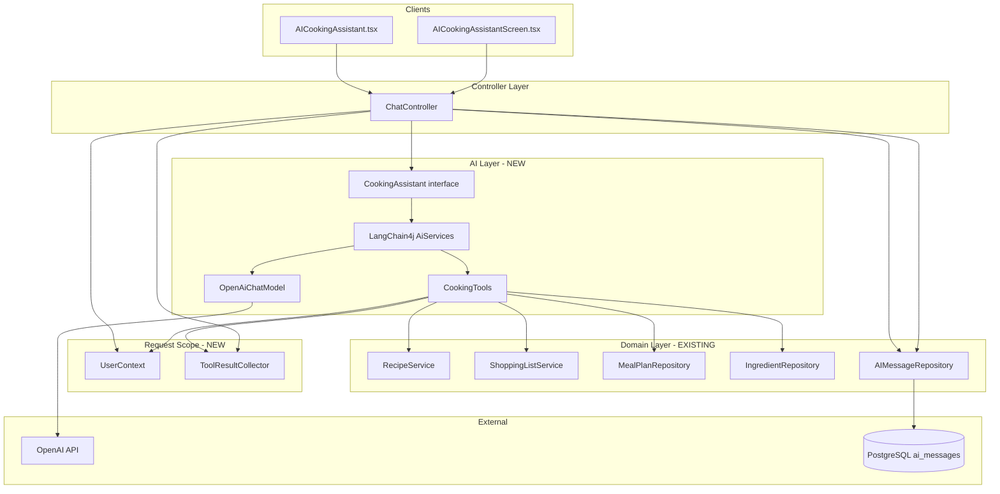
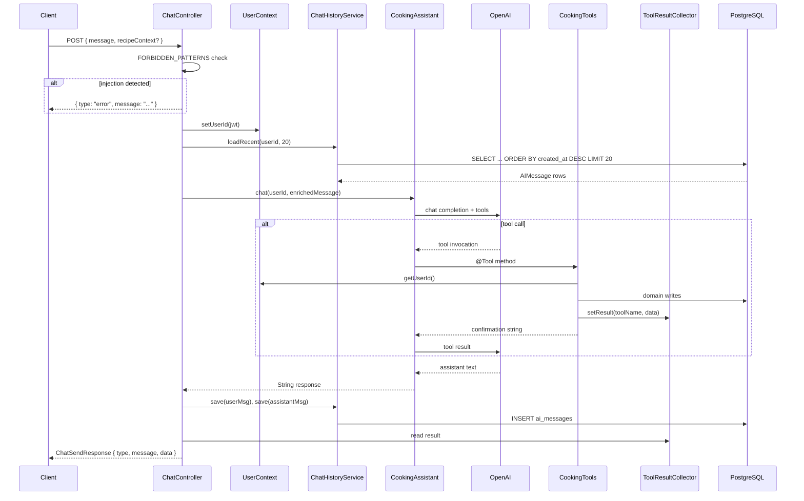
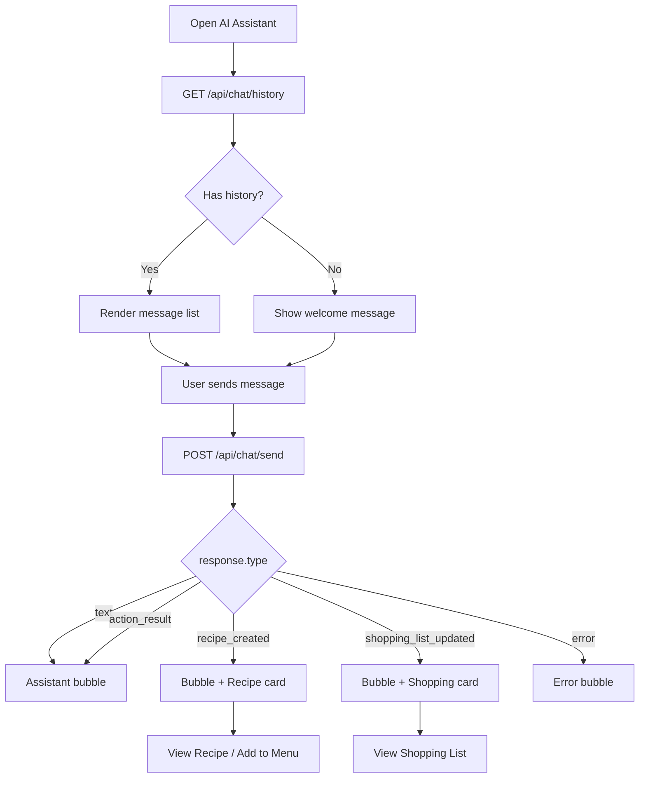

# Technical Design: Chat – LangChain4j Migration + Tool Calls

**Feature reference:** [chat-langchain4j-tools.md](../features/chat-langchain4j-tools.md)  
**Status:** Design  
**Scope:** Backend (Spring Boot), Web (`AICookingAssistant.tsx`), Mobile (`AICookingAssistantScreen.tsx`)

---

## 1. Overview

This design replaces the hand-rolled OpenAI REST + JSON-parsing chat pipeline with **LangChain4j native tool calling**, adds two new tools (`createRecipe`, `addItemsToShoppingList`), and wires persistent chat history through the existing but unused `AIMessage` entity.

### Goals

| Goal | How achieved |
|------|--------------|
| **Low coupling** | AI layer (`CookingAssistant`) is separate from domain writes (`CookingTools` → existing services/repos). Frontend reads a stable response envelope via `ToolResultCollector`, not AI text. |
| **Testable** | Tools are plain Spring beans with injectable dependencies; controller logic is thin; services/repos are mockable in unit tests. |
| **Rollbackable** | Feature is gated by dependency + config swap; old services can be restored from git; DB changes are additive (index only). |
| **No regressions** | `POST /api/chat/send` contract preserved; existing `action_result` flow retained; meal-plan and recipe APIs unchanged. |

### Non-goals (this iteration)

- SSE / streaming responses
- Session-isolated chat (`session_id` column)
- Usage quota enforcement (`UsageQuota.ai_message_sent`)
- Confirmation step before recipe/shopping-list creation

---

## 2. Architecture

### 2.1 Current state

```
Client → ChatController → OpenAIService (RestTemplate → OpenAI)
                       → ChatActionService (manual action dispatch)
                       → JSON parse → ChatSendResponse
```

- Chat is **stateless**; `AIMessage` / `AIMessageRepository` exist but are unused.
- AI returns structured JSON (`type`, `message`, `data`); actions are parsed and executed in the controller.
- Three actions: `add_recipe_to_menu`, `remove_recipe_from_menu`, `list_my_recipes`.

### 2.2 Target state

```
Client → ChatController
           ├── prompt guard (FORBIDDEN_PATTERNS)
           ├── UserContext.setUserId(jwt)
           ├── load last 20 AIMessage rows → prepend as LangChain4j history
           ├── CookingAssistant.chat(userId, message)   [LangChain4j AiServices]
           │     ├── OpenAiChatModel → OpenAI (function calling)
           │     └── CookingTools (@Tool methods)
           │           ├── RecipeService / RecipeRepository
           │           ├── ShoppingListService / IngredientRepository
           │           ├── MealPlanRepository
           │           └── ToolResultCollector (structured side-channel)
           ├── persist user + assistant AIMessage rows
           ├── map ToolResultCollector → response type
           └── ChatSendResponse
```

### 2.2 Component diagram



### 2.3 New backend components

| Component | Package | Responsibility |
|-----------|---------|----------------|
| `LangChain4jConfig` | `config` | Builds `CookingAssistant` bean via `AiServices.builder()` |
| `CookingAssistant` | `service.ai` | LangChain4j interface with `@SystemMessage` + `chat(@MemoryId, @UserMessage)` |
| `CookingTools` | `service` | `@Component` with `@Tool` methods; delegates to domain services |
| `UserContext` | `service` | `@RequestScope` holder for JWT-derived `userId` |
| `ToolResultCollector` | `service` | `@RequestScope` holder for structured tool outcome consumed by controller |
| `ChatHistoryService` | `service` | Load/save `AIMessage` rows; convert to/from LangChain4j `ChatMessage` |

### 2.4 Removed components

| Component | Replacement | Rollback |
|-----------|-------------|----------|
| `OpenAIService` | LangChain4j `OpenAiChatModel` (auto-configured) | Restore class + `ChatController` wiring from git |
| `ChatActionService` | `CookingTools` | Restore class; revert controller |

Keep deleted files recoverable via git history; do **not** remove `GET /api/chat/actions` in the first release (update action list or deprecate with stub).

### 2.5 Coupling boundaries

```
┌─────────────────────────────────────────────────────────┐
│ ChatController                                          │
│  - HTTP, auth, guards, persistence, response mapping    │
└────────────┬───────────────────────────────┬──────────────┘
             │                               │
┌────────────▼──────────────┐   ┌───────────▼──────────────┐
│ CookingAssistant (AI)     │   │ ChatHistoryService (DB)  │
│  - no JPA, no HTTP        │   │  - no OpenAI             │
└────────────┬──────────────┘   └──────────────────────────┘
             │
┌────────────▼──────────────┐
│ CookingTools              │
│  - calls RecipeService,   │
│    ShoppingListService,     │
│    repositories only      │
└───────────────────────────┘
```

- **CookingTools must not** call `ChatController`, `OpenAIService`, or construct HTTP responses.
- **ToolResultCollector** is the only bridge from tools → controller response typing.
- Reuse `RecipeService.createRecipe()` and `ShoppingListService.insertAllShoppingListItems()` where possible instead of duplicating persistence logic.

### 2.6 Configuration

**`pom.xml`** — add:

```xml
<dependency>
    <groupId>dev.langchain4j</groupId>
    <artifactId>langchain4j-open-ai-spring-boot-starter</artifactId>
    <version>1.0.0</version>
</dependency>
```

**`application.yml`** — add (reference existing env vars):

```yaml
langchain4j:
  open-ai:
    chat-model:
      api-key: ${OPENAI_API_KEY}
      model-name: ${app.openai.model:gpt-4o-mini}
      temperature: ${app.openai.temperature:0.6}
      max-tokens: ${app.openai.max-tokens:1000}
      timeout: 30s
```

Existing `app.openai.*` keys remain for backward compatibility with env files; LangChain4j reads via `${…}` references.

### 2.7 Chat memory strategy

**Recommended (v1): manual history in `ChatController`**, not a full `ChatMemoryStore` implementation.

Rationale (from feature doc): avoids complex diff/sync between LangChain4j memory and JPA; persistence is explicit and testable.

Flow per request:

1. `ChatHistoryService.loadRecent(userId, 20)` → `List<ChatMessage>`
2. Append current user message (with optional recipe context prefix)
3. Pass history + message to assistant (see §2.8)
4. After response, append two `AIMessage` rows (user raw message, assistant text)

LangChain4j `MessageWindowChatMemory(maxMessages=20)` still caps in-process window when used inside `AiServices`; DB load on each request ensures restart safety without implementing `ChatMemoryStore`.

### 2.8 CookingAssistant interface

```java
public interface CookingAssistant {
    @SystemMessage("""
        You are an AI Cooking Assistant for CookCopilot.
        ONLY answer questions about food, recipes, cooking, and ingredients.
        Refuse anything unrelated to food.
        When the user asks you to create a recipe, use the createRecipe tool.
        When the user asks to add items to the shopping list, use the addItemsToShoppingList tool.
        When the user asks to add/remove recipes from their menu, use the appropriate menu tools.
        """)
    String chat(@MemoryId UUID userId, @UserMessage String userMessage);
}
```

Bean construction in `LangChain4jConfig`:

```java
@Bean
CookingAssistant cookingAssistant(OpenAiChatModel model, CookingTools tools) {
    return AiServices.builder(CookingAssistant.class)
        .chatModel(model)
        .chatMemoryProvider(id -> MessageWindowChatMemory.builder()
            .id(id)
            .maxMessages(20)
            .build())
        .tools(tools)
        .build();
}
```

On first call for a user in a JVM session, `ChatController` pre-seeds memory by loading DB history (via a small `ChatMemorySeeder` helper) **or** passes explicit prior messages if using manual-history mode.

---

## 3. API Flow

### 3.1 Endpoints

| Method | Path | Change | Purpose |
|--------|------|--------|---------|
| `POST` | `/api/chat/send` | **Modify** (internal rewrite) | Send message; same request/response shape |
| `GET` | `/api/chat/history` | **New** | Load last 50 messages for UI hydration |
| `GET` | `/api/chat/actions` | **Keep** | List tool names (updated list) |

All endpoints remain JWT-protected under existing Spring Security config.

### 3.2 `POST /api/chat/send` — sequence



### 3.3 Request body (unchanged)

`ChatSendRequest`:

```json
{
  "message": "Make me a pasta recipe",
  "recipe_context": {
    "recipeId": "uuid",
    "recipeName": "Chicken Alfredo"
  }
}
```

Controller enriches message when `recipeContext` is present (same as today):

```
[Context: User is viewing recipe with ID: {recipeId}, name: "{recipeName}"]

{message}
```

Pantry context remains **client-prepended** in the message string (no API change).

### 3.4 Response envelope

`ChatSendResponse` DTO unchanged (`type`, `message`, `data`).

| `type` | Trigger | `data` |
|--------|---------|--------|
| `text` | No tool ran | `{}` or omitted |
| `recipe_created` | `createRecipe` tool | `{ recipeId, recipeName, ingredientCount, steps }` |
| `shopping_list_updated` | `addItemsToShoppingList` tool | `{ itemsAdded, items: [{ name, quantity, unit }] }` |
| `action_result` | `addRecipeToMenu` / `removeRecipeFromMenu` | Same shape as today (`mealPlanId`, `recipeName`, etc.) |
| `error` | OpenAI failure, uncaught exception | `{}` |

**Dropped types** (frontend must stop depending on them): `recipe`, `tip`, `clarification`, `refusal`, `action_error`. Map guard refusals to `error` with a friendly `message`.

Controller mapping logic:

```java
if (toolResultCollector.hasResult()) {
    return mapToolResult(toolResultCollector, aiText);
}
return new ChatSendResponse("text", aiText, Map.of());
```

### 3.5 `GET /api/chat/history` — new

**Response:**

```json
{
  "messages": [
    { "id": "uuid", "role": "user", "content": "...", "createdAt": 1718000000 },
    { "id": "uuid", "role": "assistant", "content": "...", "createdAt": 1718000001 }
  ]
}
```

- Returns last **50** rows, ascending by `created_at`.
- Used on chat mount to replace welcome-only state.
- Does not expose token counts or system messages.

**Repository method:**

```java
List<AIMessage> findTop50ByUserIdOrderByCreatedAtDesc(UUID userId);
// reversed in service to ascending for UI
```

### 3.6 Tool definitions (`CookingTools`)

| Tool | AI parameters | Domain call | TRC `toolName` | Response `type` |
|------|---------------|-------------|----------------|-----------------|
| `listMyRecipes` | — | `recipeRepository.findByUserId` | — (AI-only) | `text` |
| `addRecipeToMenu` | `recipeId`, `mealType` | `MealPlanRepository.save` | `addRecipeToMenu` | `action_result` |
| `removeRecipeFromMenu` | `mealPlanId` | `MealPlanRepository.delete` | `removeRecipeFromMenu` | `action_result` |
| `createRecipe` | `name`, `description?`, `ingredients[]`, `steps[]` | `RecipeService` or inline save | `createRecipe` | `recipe_created` |
| `addItemsToShoppingList` | `items[]` | `ShoppingListService.insertAllShoppingListItems` | `addItemsToShoppingList` | `shopping_list_updated` |

**Parameter records** (LangChain4j POJOs):

```java
public record IngredientInput(String name, String quantity, String unit, String note) {}
public record ShoppingItemInput(String name, String quantity, String unit) {}
```

**Validation inside tools:**

- `ingredients.size() <= 30`, `items.size() <= 30` — throw `IllegalArgumentException` caught by tool wrapper → error string to AI.
- `UUID.fromString` wrapped in try/catch per tool.
- `addRecipeToMenu`: verify recipe belongs to user (`findById` + `userId` equality, or add `findByIdAndUserId` to `RecipeRepository`).

**Ingredient resolution:** add `IngredientRepository.findByNameIgnoreCase(String)` and batch helper `findAllByNameInIgnoreCase(Collection<String>)` to avoid N+1 (see §4).

---

## 4. DB Changes

### 4.1 Schema changes

| Change | Type | Required |
|--------|------|----------|
| Index `idx_ai_messages_user_created` on `(user_id, created_at DESC)` | **Additive** | Yes |
| `ai_messages` table columns | None | — |
| `session_id` on `ai_messages` | Deferred | No |

**Migration SQL** (apply via `schema.sql` + Flyway/manual script if used):

```sql
CREATE INDEX IF NOT EXISTS idx_ai_messages_user_created
    ON ai_messages (user_id, created_at DESC);
```

Hibernate `ddl-auto: update` will **not** create functional indexes reliably; run SQL explicitly in deployment.

### 4.2 Repository changes

**`AIMessageRepository`:**

```java
List<AIMessage> findTop20ByUserIdOrderByCreatedAtDesc(UUID userId);
List<AIMessage> findTop50ByUserIdOrderByCreatedAtDesc(UUID userId);
```

Existing `findByUserIdOrderByCreatedAtAsc` can remain for tests.

**`IngredientRepository`:**

```java
Optional<Ingredient> findByNameIgnoreCase(String name);
List<Ingredient> findAllByNameInIgnoreCase(Collection<String> names);
```

**`RecipeRepository` (security fix):**

```java
Optional<Recipe> findByIdAndUserId(UUID id, UUID userId);
```

### 4.3 Persistence per chat turn

After successful AI call:

| Row | `role` | `content` | Notes |
|-----|--------|-----------|-------|
| 1 | `user` | Raw `request.message` (without pantry prefix optional — pick one and document) | Store user-visible text only |
| 2 | `assistant` | LangChain4j text response | Not raw OpenAI JSON |

Token fields: populate `tokenIn` / `tokenOut` from LangChain4j response metadata when available; default `0`.

### 4.4 Rollback

- Dropping the index is safe if rolling back the feature.
- `AIMessage` rows written during the new feature remain valid; old code simply ignores them.
- No destructive migrations.

---

## 5. UI Flow

### 5.1 Web — `AICookingAssistant.tsx`

#### Mount

1. Call `GET /api/chat/history`.
2. If messages exist, replace default welcome message with history.
3. If empty, keep current welcome bubble.

#### Send message (unchanged UX)

1. User types → append user bubble locally.
2. Show typing indicator.
3. `POST /api/chat/send` with pantry-prefixed message.
4. Append assistant text bubble from `response.message`.
5. **Branch on `response.type`:**

| `type` | UI element |
|--------|------------|
| `text` | Text bubble only |
| `action_result` | Text bubble (existing behavior) |
| `recipe_created` | Text bubble + **Recipe Created card** |
| `shopping_list_updated` | Text bubble + **Shopping List Updated card** |
| `error` | Error-styled bubble |

#### `recipe_created` card

```
┌─────────────────────────────────────┐
│ 🍳 {recipeName}                     │
│ {ingredientCount} ingredients ·       │
│ {steps.length} steps                  │
│ [View Recipe]  [Add to Menu]          │
└─────────────────────────────────────┘
```

- **View Recipe:** navigate to Recipe Manager with `recipeId` pre-selected.
  - Requires extending `App.tsx` navigation: e.g. `setSelectedRecipeId(id)` + `setCurrentView('recipeManager')`.
  - On navigation, call `pantryContext` recipe refresh so list is not stale.
- **Add to Menu:** `POST /api/meal-plan` with `{ recipeId, mealType: "dinner" }` (existing `mealPlanApi`).

#### `shopping_list_updated` card

```
┌─────────────────────────────────────┐
│ Added {itemsAdded} items to your    │
│ shopping list                       │
│ [chip] [chip] [chip] ...            │
│ [View Shopping List]                │
└─────────────────────────────────────┘
```

- **View Shopping List:** `setCurrentView('shoppingList')`; refresh shopping list in context.

#### Removed UI paths

- `type === 'recipe'` suggestion cards (AI now persists via tool).
- localStorage `aiSavedRecipes` flow can remain for legacy saved items but is no longer fed by API.

#### Typing indicator

Keep existing pulsing dots during synchronous wait (3–6s with tools).

### 5.2 Mobile — `AICookingAssistantScreen.tsx`

Mirror web card behavior using existing patterns:

- `navigation.navigate('RecipeManager', { recipeId })` (verify stack param support in navigator).
- `navigation.navigate('ShoppingList')`.
- Recipe card: reuse inline `View` / `TouchableOpacity` styling from existing recipe suggestion block.
- Call `GET /api/chat/history` on mount (add to mobile `chatApi`).

### 5.3 API client updates

**Web & mobile `api/chat.ts`:**

```typescript
export interface ChatResponse {
  type: 'text' | 'recipe_created' | 'shopping_list_updated'
      | 'action_result' | 'error';
  message: string;
  data?: Record<string, unknown>;
}

getHistory: () => api.get<{ messages: HistoryMessage[] }>('/api/chat/history'),
```

`POST /api/chat/send` URL and payload unchanged — **no breaking change** for other consumers.

### 5.4 UI flow diagram



---

## 6. State Management

### 6.1 Backend

| State | Scope | Owner |
|-------|-------|-------|
| `userId` | Request | `UserContext` — set once in controller from JWT |
| Tool side effects | Request | `ToolResultCollector` — written by tools, read by controller |
| Chat history (long-term) | User | `ai_messages` table via `ChatHistoryService` |
| Chat memory (short-term) | User / JVM | LangChain4j `MessageWindowChatMemory` (max 20) |

**Threading rule:** `ChatController.send()` must set `UserContext` before invoking `CookingAssistant.chat()` on the same request thread (Spring `@RequestScope`).

### 6.2 Web frontend

| State | Location | Notes |
|-------|----------|-------|
| Message list | `AICookingAssistant` `useState<Message[]>` | Hydrated from `/history`, appended on send |
| Typing | `isTyping` | Local UI |
| Pantry / recipes / shopping | `pantryContext` | Refresh after `recipe_created` / `shopping_list_updated` navigation |
| Selected recipe for navigation | `App.tsx` or context | New optional `selectedRecipeId` for Recipe Manager deep link |

**Clear chat:** today resets local state only. With persistence, either:

- **v1:** local clear only (history reloads on remount) — document as known limitation, or
- **v1.1:** add `DELETE /api/chat/history` (out of scope unless product requires).

### 6.3 Mobile frontend

Same pattern: local `messages` state + `pantryContext` for data refresh. No global chat store required.

---

## 7. Error Handling

### 7.1 Layered handling

| Layer | Condition | Behavior |
|-------|-----------|----------|
| Controller guard | `FORBIDDEN_PATTERNS` match | Return `{ type: "error", message: friendly refusal }` — no OpenAI call |
| Controller | `CookingAssistant.chat()` throws | Log error; return `{ type: "error", message: generic }` |
| Tool | Invalid UUID | Return error string to AI; AI explains to user; no TRC entry |
| Tool | Recipe not found / wrong user | Error string to AI |
| Tool | List > 30 items | `IllegalArgumentException` → caught → error string |
| Tool | DB failure | Log; error string to AI; optionally set TRC with partial failure |
| OpenAI | Timeout (30s) | `{ type: "error" }`; do not persist assistant row |
| OpenAI | Rate limit / 5xx | Same as timeout |

### 7.2 Persistence on failure

| Scenario | Persist user message? | Persist assistant message? |
|----------|----------------------|----------------------------|
| Guard refusal | No | No |
| OpenAI failure | Optional (yes for audit) | No |
| Tool error with AI reply | Yes | Yes |
| Success | Yes | Yes |

Recommendation: persist user message on OpenAI failure so history reflects user intent; assistant row omitted.

### 7.3 Frontend error display

- Network / `success: false`: existing generic error bubble (web + mobile).
- `type: "error"`: show `message` from server in assistant bubble.
- Do not expose stack traces or OpenAI raw responses.

### 7.4 Edge cases (from feature spec)

| Case | Handling |
|------|----------|
| Duplicate recipe name | Allow; mention in tool return string |
| Ingredient case mismatch | `findByNameIgnoreCase`; create if missing |
| `createRecipe` with 0 ingredients | Allowed |
| Duplicate shopping list names | Separate rows (existing bulk behavior) |
| Empty `addItemsToShoppingList` | Early return string; no TRC |
| Long history | Window of 20 for AI context; 50 for UI load |

---

## 8. Security

### 8.1 Threat model

| Risk | Severity | Mitigation |
|------|----------|------------|
| Prompt injection | High | Keep `FORBIDDEN_PATTERNS`; run before LangChain4j; extend with newline / Unicode lookalike variants |
| userId spoofing via tools | High | `UserContext` from JWT only; never a tool parameter |
| Cross-user recipe access | High | `findByIdAndUserId` on menu/recipe tools |
| Tool call flood | Medium | Defer quota to follow-up; log tool invocations |
| Mass creation in one turn | Medium | Max 30 ingredients / 30 shopping items per tool call |
| Data leak via `listMyRecipes` | Low | Query scoped to `UserContext.userId` |
| API key in logs | Low | Disable verbose HTTP logging in prod; rely on Spring redaction |
| System prompt leak | Low | Never return raw OpenAI payload to client |

### 8.2 AuthZ matrix

| Operation | Authorization |
|-----------|---------------|
| `POST /api/chat/send` | Authenticated user; acts on own `userId` |
| `GET /api/chat/history` | Same user’s messages only |
| `createRecipe` | Creates row with `UserContext.userId` |
| `addItemsToShoppingList` | Items scoped to `UserContext.userId` |
| `addRecipeToMenu` | Recipe must belong to user |

### 8.3 Input sanitization

- User message: max length validation on `ChatSendRequest.message` (add `@Size(max = 4000)` if not present).
- Tool inputs: validate list sizes server-side; AI cannot bypass.
- Recipe context IDs: validate UUID format before prefixing.

---

## 9. Test Strategy

### 9.1 Unit tests

| Target | Cases |
|--------|-------|
| `CookingTools.createRecipe` | Happy path; 0 ingredients; >30 ingredients throws; invalid UUID |
| `CookingTools.addItemsToShoppingList` | Bulk insert; empty list; duplicate names |
| `CookingTools.addRecipeToMenu` | Own recipe succeeds; other user’s recipe fails |
| `ToolResultCollector` | Set/get/clear per request |
| `ChatHistoryService` | Load order; save pair; limit 20/50 |
| `ChatController` guard | Each forbidden pattern returns error without calling assistant |

Use `@MockBean` for `CookingAssistant` in controller tests to isolate HTTP layer.

### 9.2 Integration tests

| Test | Setup |
|------|-------|
| Full send without tool | Mock `OpenAiChatModel` or WireMock OpenAI |
| Send triggering tool | Verify DB rows (`recipes`, `shopping_list_items`, `ai_messages`) |
| History endpoint | Insert fixtures; assert ordering and auth isolation |
| Index performance | Explain plan on `ai_messages` query (manual/CI smoke) |

Testcontainers PostgreSQL recommended for repository integration tests.

### 9.3 Frontend tests

| Surface | Focus |
|---------|-------|
| Web | Render `recipe_created` / `shopping_list_updated` cards; history hydration mock |
| Mobile | Same card types in `renderMessage` |

Manual QA checklist:

- [ ] Existing meal-plan action via chat still works (`action_result`)
- [ ] Create recipe from chat appears in Recipe Manager
- [ ] Shopping list items visible after tool
- [ ] Page refresh shows prior messages
- [ ] Mobile navigation buttons work

### 9.4 Regression / rollback verification

Before merge:

1. Run existing app flows: recipe CRUD, shopping list, calendar, pantry (unchanged APIs).
2. Tag release commit before deleting `OpenAIService` / `ChatActionService`.
3. Rollback drill: revert commit, redeploy, confirm chat works on old path (stateless).
4. Forward deploy again; confirm `ai_messages` index exists.

### 9.5 Test data

Use existing mock users from `schema.sql`. Do not commit real `OPENAI_API_KEY` in tests — mock the model bean in `@SpringBootTest`.

---

## 10. Implementation Plan

### Phase 1 — Backend foundation (rollback-safe)

1. Add LangChain4j dependency + `application.yml` block.
2. Add DB index + repository methods.
3. Implement `UserContext`, `ToolResultCollector`, `ChatHistoryService`.
4. Implement `CookingTools` delegating to existing services.
5. Implement `LangChain4jConfig` + `CookingAssistant`.
6. Rewrite `ChatController`; keep old services behind a feature flag **or** delete after parity tests pass.
7. Add `GET /api/chat/history`.

### Phase 2 — Frontend

1. Update `ChatResponse` types + `getHistory`.
2. Web: history on mount + new cards + navigation hooks.
3. Mobile: same.

### Phase 3 — Cleanup

1. Remove `OpenAIService`, `ChatActionService`.
2. Update `GET /api/chat/actions` tool list.
3. Update `docs/Overall Project Structure.md` (optional, separate PR).

---

## 11. Rollback Plan

| Step | Action |
|------|--------|
| 1 | Revert deploy to previous git tag |
| 2 | Restore `OpenAIService` + `ChatActionService` + old `ChatController` |
| 3 | Remove LangChain4j dependency (or leave unused — harmless) |
| 4 | Index on `ai_messages` can remain |
| 5 | Historical `ai_messages` rows ignored by old code |

No data loss; recipes/shopping items created by tools remain in DB.

---

## 12. File Checklist

### Create

| File |
|------|
| `config/LangChain4jConfig.java` |
| `service/ai/CookingAssistant.java` |
| `service/CookingTools.java` |
| `service/UserContext.java` |
| `service/ToolResultCollector.java` |
| `service/ChatHistoryService.java` |
| `dto/ChatHistoryResponse.java` (optional) |

### Modify

| File |
|------|
| `pom.xml` |
| `application.yml` |
| `controller/ChatController.java` |
| `repository/AIMessageRepository.java` |
| `repository/IngredientRepository.java` |
| `repository/RecipeRepository.java` |
| `schema.sql` (index) |
| `frontend/client/src/components/AICookingAssistant.tsx` |
| `frontend/client/src/api/chat.ts` |
| `frontend/client/src/App.tsx` (navigation state) |
| `mobile/src/screens/AICookingAssistantScreen.tsx` |
| `mobile/src/api/chat.ts` |

### Delete (after parity)

| File |
|------|
| `service/OpenAIService.java` |
| `service/ChatActionService.java` |

---

## 13. Open Questions

| # | Question | Default if unresolved |
|---|----------|----------------------|
| 1 | Store pantry prefix in `ai_messages` or strip it? | Store **stripped** user text only |
| 2 | Clear chat — local only or server endpoint? | Local only in v1 |
| 3 | `GET /api/chat/actions` — keep or deprecate? | Keep with updated tool names |
| 4 | Default folder for AI-created recipes? | `null` / uncategorized (match manual create) |

---

## 14. Success Criteria

- [ ] Chat uses LangChain4j with native tool calling; no JSON action parsing in controller.
- [ ] Five tools operational; two new tools persist recipes and shopping list items.
- [ ] Last 20 messages included in AI context; last 50 load in UI on mount.
- [ ] `recipe_created` and `shopping_list_updated` cards render on web and mobile.
- [ ] Existing meal-plan chat actions return `action_result` as before.
- [ ] `POST /api/chat/send` request shape unchanged.
- [ ] Prompt guard and userId scoping enforced.
- [ ] DB index applied; no full-table scan on history load.
- [ ] Rollback path verified.
