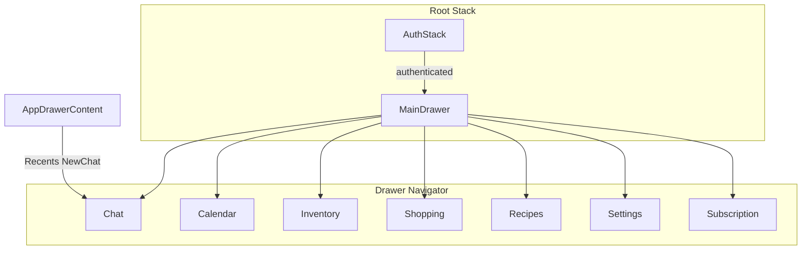

# Technical Design: Mobile Chat-First Navigation

**Feature reference:** [mobile-chat-first-nav.md](../features/mobile-chat-first-nav.md)  
**Status:** Implemented  
**Scope:** `mobile/` navigation + Chat empty state + drawer Recents  
**Out of scope:** Backend, web, theme restyle, session rename/delete

---

## 1. Architecture Overview

### 1.1 Where it fits

Replace bottom-tabs shell with a **drawer navigator** as the authenticated main shell. Chat is the default drawer route. Tool screens stay the same components; only registration and headers change.



### 1.2 Design decisions (resolves feature §10)

| # | Topic | Decision | Rationale |
|---|--------|----------|-----------|
| 1 | Package | `@react-navigation/drawer` via `npx expo install` | Matches existing React Navigation 7 stack |
| 2 | Shell | Single `createDrawerNavigator`; **no** bottom tabs | One nav system |
| 3 | Route names | `Chat`, `Calendar`, `Inventory`, `Shopping`, `Recipes`, `Settings`, `Subscription` | Clear; Inventory = pantry screen |
| 4 | Custom drawer | `drawerContent={AppDrawerContent}` | Three-layer Claude IA |
| 5 | Session state | Stay in `AICookingAssistantScreen`; expose callbacks via React context `ChatSessionNavContext` **or** drawer reads `chatApi` directly and navigates with params | Prefer **params + screen handlers**: drawer calls `navigation.navigate('Chat', { sessionId \| newChat: true })`; Chat reacts in `useEffect` — minimal new state |
| 6 | Empty state | Extract `ChatEmptyState` component | Home merge without bloating screen |
| 7 | Header | `AppHeader` gains `showMenuButton` → `DrawerActions.openDrawer()` | Shared chrome |
| 8 | Session pills | **Remove** horizontal pills on Chat | Avoid duplicate Recents UI |
| 9 | HomeScreen | Delete file; drop imports | Locked |
| 10 | AskAiEmptyCta | Remove call sites; delete component if unused | Locked |
| 11 | Lazy | `lazy: true` on drawer screens | Perf |
| 12 | Maestro | Replace tab taps with drawer open + item testIDs | E2E |

### 1.3 Architectural conflicts

| Conflict | Resolution |
|----------|------------|
| Card actions navigate `Main` + `*Tab` | Change to `navigation.navigate('Inventory' \| 'Shopping' \| …)` within drawer |
| Subscription was stack sibling | Become drawer screen (or stack outside drawer) — **drawer screen** for one shell |
| Spring without sessions | `listSessions` fail → empty Recents; Chat history without sessionId still works |
| `initialPrompt` route param | Keep optional on Chat for future; no tool CTAs set it in v1 |

No DB / API schema changes.

---

## 2. Data Models / Schema

None new. Reuse:

```ts
// existing ChatSession from mobile/src/api/chat.ts
{ id, title, isDefault, updatedAt, ... }
```

Drawer Recents display: `session.title || t('nav.aiChat')`, sorted by API order (already recent-first if backend returns that; otherwise sort by `updatedAt` desc client-side if field exists).

---

## 3. Interface Design

### 3.1 Packages

```bash
cd mobile && npx expo install @react-navigation/drawer
```

### 3.2 Navigation types (conceptual)

```ts
export type MainDrawerParamList = {
  Chat: { sessionId?: string; newChat?: boolean; initialPrompt?: string } | undefined;
  Calendar: undefined;
  Inventory: { /* existing pantry params if any */ } | undefined;
  Shopping: undefined;
  Recipes: { recipeId?: string } | undefined;
  Settings: undefined;
  Subscription: undefined;
};
```

### 3.3 Core components

| Component | Responsibility |
|-----------|----------------|
| `App.tsx` `MainDrawer` | Register screens; `drawerContent`; hide default drawer labels if custom |
| `AppDrawerContent.tsx` | Primary list, Recents (`listSessions`), footer New chat / Settings / Subscription |
| `AppHeader.tsx` | `showMenuButton?: boolean` |
| `ChatEmptyState.tsx` | Greeting, tagline, optional counts, suggested prompts (prompts may stay in parent composer area) |

### 3.4 Chat param handling

On `Chat` focus / param change:

- `newChat: true` → `createSession`, welcome, clear param  
- `sessionId` → `handleSwitchSession`, clear param  

### 3.5 i18n keys (add)

```json
"nav": {
  "inventory": "Inventory",
  "subscription": "Subscription",
  "recents": "Recents",
  "newChat": "New chat",
  "openMenu": "Open menu"
},
"ai": {
  "greetingMorning": "...",
  "greetingAfternoon": "...",
  "greetingEvening": "...",
  "emptyTagline": "..." // or reuse nav.tagline
}
```

zh mirrors.

---

## 4. Business Logic Flow

### 4.1 Open Recents item

1. User opens drawer → `AppDrawerContent` fetches/refreshes `listSessions` on open.  
2. Tap session → `navigation.navigate('Chat', { sessionId })` + `closeDrawer()`.  
3. Chat loads history for that id.

### 4.2 New chat

1. Footer button → `navigate('Chat', { newChat: true })` + close.  
2. Chat creates session, sets welcome empty state, refreshes session list for next drawer open.

### 4.3 Tool screen headers

Each tool screen: `AppHeader` with `showMenuButton` (not back, unless nested modal within screen). Subscription/Settings same.

### 4.4 Remove AI CTAs

Calendar / Pantry / Shopping / Recipes: delete `AskAiEmptyCta` blocks; keep plain empty copy.

---

## 5. Edge Cases & Error Handling

| Case | Handling |
|------|----------|
| `listSessions` fails | Recents section empty; optional muted “Couldn’t load chats” |
| `createSession` fails | Alert; stay on current session |
| Rapid drawer open | Debounce or ignore overlapping fetches with abort/ignore stale |
| Logout mid-drawer | Auth stack replaces tree; fine |

---

## 6. Performance & Security

- Lazy drawer screens.  
- Recents fetch on drawer `state` open only (not every render).  
- JWT unchanged on chat APIs.  
- No client-side session cache across users beyond in-memory Chat state (remount on auth change).

---

## 7. Test plan

- Unit: greeting helper (time-of-day) if extracted; drawer route map helpers if any.  
- `tsc --noEmit` + Jest.  
- Maestro: open menu → tap Inventory / Settings; Chat visible on launch.  
- Manual: Recents switch, New chat, card navigate to Recipes/Shopping.

---

## 8. File change list

| Action | Path |
|--------|------|
| Modify | `mobile/App.tsx` |
| Modify | `mobile/package.json` (drawer dep) |
| Add | `mobile/src/navigation/AppDrawerContent.tsx` |
| Add | `mobile/src/components/chat/ChatEmptyState.tsx` |
| Modify | `mobile/src/components/AppHeader.tsx` |
| Modify | `mobile/src/screens/AICookingAssistantScreen.tsx` |
| Delete | `mobile/src/screens/HomeScreen.tsx` |
| Modify | Calendar / Pantry / Shopping / Recipes screens (CTAs + headers) |
| Delete | `AskAiEmptyCta.tsx` if unused |
| Modify | `en.json`, `zh.json` |
| Modify | `.maestro/smoke.yaml` (+ related) |
| Optionally retire | `tabBarStyle.ts` if unused |

---

## 9. Implementation order

Aligns with `tasks/mobile-chat-first-nav/`: install drawer → shell → drawer content → header/empty state → remove Home/CTAs → i18n → Maestro/tests → signoff.
