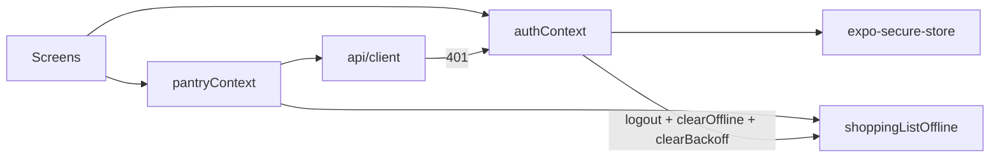

# Technical Design: Mobile Full Hardening

**Feature reference:** [mobile-hardening.md](../features/mobile-hardening.md)  
**Status:** Design  
**Scope:** Mobile client hardening (方案 A)

---

## 1. Architecture Overview

### 1.1 Auth

- `authHelper` stores JWT in SecureStore; migrates legacy AsyncStorage `jwt` once.
- `client.ts` reads token via `authHelper.getJWT()`; on HTTP 401 calls `onUnauthorized`.
- `AuthProvider` registers logout as unauthorized handler; cold start rejects expired JWT (`exp`).
- Settings logout only calls `logout()`; `RootNavigator` switches stacks on `isAuthenticated`.

### 1.2 Shopping list concurrency

- Mutations always `loadSnapshot(userId)` (when logged in) before computing `next`.
- `markAllShoppingListChecked`: one snapshot load → map all checked → one `saveSnapshot` + enqueue updates → one flush schedule.
- Flush lock conflict returns `ok: false` (`Sync in progress`), not fake success.
- `clearBackoff(userId)` exported and called on logout.

### 1.3 Context tighten

- `loading` object: `{ recipes, pantry, shopping, mealPlan, ingredients }` plus derived `loadingAny` for callers that need a boolean.
- Provider `value` wrapped in `useMemo`.
- Skip `userPreferencesApi.get()` when `!userId`.

### 1.4 Single source of truth

- `RecipeManagerScreen` / `CalendarScreen` consume context lists; local state only for UI (forms, selection, view mode).
- `useFocusEffect` refetch on Recipes tab.

### 1.5 UX / brand

- Header: `insets.top + 12` on both platforms.
- Root tabs: no `showBackButton`.
- `GestureHandlerRootView` at app root; list rows use GH `Pressable` + `usePressScale`.
- Chat KAV offset from header `onLayout`.
- Calendar list mode → FlashList.
- IAP Android product IDs + `app.json` slug → LarderMind.

---

## 2. Testing

- auth-helper SecureStore + migrate
- client 401 handler
- shopping concurrent / mark-all snapshot integrity
- sync lock `ok: false`
- existing offline + tabBar tests stay green
