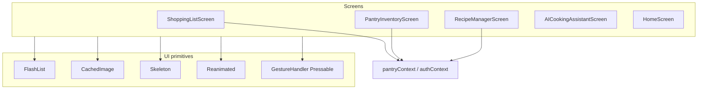

# Technical Design: Mobile RN Fluency

**Feature reference:** [mobile-rn-fluency.md](../features/mobile-rn-fluency.md)  
**Status:** Implemented  
**Scope:** Mobile (`mobile/`) performance playbook — lists, images, motion, skeletons, optimistic UX  
**Out of scope:** Backend CDN, Web Workers / custom TurboModules, store migration

---

## 1. Architecture Overview

### 1.1 Where it fits

Cross-cutting **presentation-layer** improvements. New shared UI primitives live under `mobile/src/components/ui/`. Screens migrate independently; `pantryContext` changes only if optimistic rollback needs tightening (prefer screen-local).

```
Screens (Shopping / Pantry / Recipes / AI / Home)
        │
        ├── FlashList + memoized *Row components
        ├── CachedImage (expo-image)
        ├── Skeleton* placeholders
        └── Reanimated + Gesture Handler press feedback
        │
        ▼
Existing contexts (auth, pantry) — domain only; no scroll/search
```



### 1.2 Design decisions (resolves feature §10)

| # | Topic | Decision | Rationale |
|---|--------|----------|-----------|
| 1 | List library | `@shopify/flash-list` v2 via `npx expo install` | Cell recycling; Expo 54 compatible; v2 auto-measures |
| 2 | Row size hints | `listPerf.ts` constants for docs / future layout overrides | v2 dropped required `estimatedItemSize` |
| 3 | Nested lists | One FlashList; chrome in `ListHeaderComponent` / section header items | Fixes VirtualizedList-in-ScrollView |
| 4 | Recipes structure | Flatten folders + recipes into typed list data with header rows | Keeps single scroll owner |
| 5 | Images | `CachedImage` wrapping `expo-image` | Already a dependency |
| 6 | Hero size | Unsplash `w=800` (or device-scaled) | Cuts memory vs `w=1600` |
| 7 | Skeleton | `Skeleton` + `SkeletonListRow` + thin screen wrappers | Warm Kitchen tokens |
| 8 | Motion v1 | Reanimated press scale on Shopping row | Proves UI-thread path without swipe complexity |
| 9 | Gestures v1 | `Pressable` from `react-native-gesture-handler` on rows | Native press; no swipe-to-delete |
| 10 | Optimistic | Keep pantryContext local-first; screens must not await before visual toggle when API already optimistic | Documented contract |
| 11 | Heavy compute | No workers; memoize filters only | Scope control |

### 1.3 Architectural conflicts

| Conflict | Resolution |
|----------|------------|
| FlashList requires `estimatedItemSize`; chat rows vary | Use ~72–96 estimate; accept minor jump; optional `overrideItemLayout` later |
| Recipes UI has forms + lists | Put forms/search in `ListHeaderComponent` or sibling above FlashList with `flex:1` list |
| `expo-image` ImageBackground | Use `CachedImage` with `style={{ position:'absolute', ... }}` filling hero |
| Jest + FlashList | Mock `@shopify/flash-list` as FlatList-compatible in `jest.setup.js` |

No DB / API schema changes.

---

## 2. Data Models / Schema

None for backend.

### 2.1 List row constants

```ts
// mobile/src/constants/listPerf.ts
export const ESTIMATED_SHOPPING_ROW = 72;
export const ESTIMATED_PANTRY_ROW = 72;
export const ESTIMATED_RECIPE_ROW = 64;
export const ESTIMATED_FOLDER_HEADER = 48;
export const ESTIMATED_CHAT_ROW = 88;
```

### 2.2 Recipes flattened item (client-only)

```ts
type RecipeListEntry =
  | { type: 'folder'; id: string; name: string }
  | { type: 'recipe'; id: string; folderId: string | null; recipe: Recipe };
```

### 2.3 Image helper

```ts
function constrainUnsplashUrl(url: string, width: number): string
// If unsplash, set/replace w=; else return url unchanged
```

---

## 3. Interface Design

### 3.1 `CachedImage`

**Path:** `mobile/src/components/ui/CachedImage.tsx`

```ts
type CachedImageProps = {
  uri?: string | null;
  style?: StyleProp<ImageStyle>;
  className?: string;
  contentFit?: ImageContentFit; // default 'cover'
  recyclingKey?: string;
  accessibilityLabel?: string;
  placeholderColor?: string; // Warm Kitchen linen/sage
};
```

- Wraps `expo-image` `Image` with `cachePolicy="memory-disk"`.
- Empty `uri` → colored placeholder View (no crash).

### 3.2 Skeleton primitives

**Path:** `mobile/src/components/ui/Skeleton.tsx`

```ts
function Skeleton(props: { width?: number | string; height?: number; className?: string; rounded?: boolean })
function SkeletonListRow(props: { lines?: 1 | 2 })
function SkeletonList(props: { count?: number })
```

Optional light Reanimated opacity pulse (UI thread). Prefer CSS/NativeWind pulse if simpler and stable in Jest.

### 3.3 Memoized rows

| Screen | Component | File |
|--------|-----------|------|
| Shopping | `ShoppingListRow` | `mobile/src/components/shopping/ShoppingListRow.tsx` |
| Pantry | `PantryItemRow` | `mobile/src/components/pantry/PantryItemRow.tsx` |
| Recipes | `RecipeListRow` / `FolderHeaderRow` | `mobile/src/components/recipes/` |
| AI | `ChatMessageRow` | extract or memo in place |

Each: `export default React.memo(Row)`.

### 3.4 Press feedback hook

```ts
// mobile/src/hooks/usePressScale.ts
// returns animatedStyle + gesture-handler Pressable handlers using Reanimated
```

Used by Shopping row check / row press.

---

## 4. Business Logic Flow

### 4.1 Migration order

1. Verify engine flags (docs task only / checklist).
2. Install FlashList; add Jest mock.
3. Ship `CachedImage` + Skeleton primitives + `listPerf` constants.
4. Shopping → Pantry → Recipes → AI chat → Home hero.
5. Wire skeletons into load gates.
6. Reanimated press on Shopping row.
7. Tests + acceptance.

### 4.2 Shopping load + list

```
mount → if shoppingList empty && fetching → SkeletonList
      → else FlashList(filteredItems, ShoppingListRow, estimatedItemSize=72)
toggle → context optimistic update (existing) → UI already new; fail → rollback via context
```

### 4.3 Pantry / Recipes un-nest

```
Before: ScrollView { header, form, FlatList scrollEnabled=false }
After:  View flex-1 { FlashList ListHeaderComponent=header+form, data=items }
```

### 4.4 Home hero

```
authLoading → Skeleton hero block (not only spinner)
else → CachedImage absolute fill + existing overlays; Unsplash w constrained
```

---

## 5. Edge Cases & Error Handling

| Case | Handling |
|------|----------|
| FlashList empty data | `ListEmptyComponent` = existing empty UX |
| Image fail | expo-image onError → keep placeholder |
| estimatedItemSize wrong | Tune constants; no crash |
| Context re-render | Memo rows + stable callbacks (`useCallback`) for toggle handlers |
| Offline shopping | Unchanged offline module; FlashList only presentation |

---

## 6. Performance & Security

### 6.1 Performance

- FlashList recycling + memo rows.
- Reanimated press on UI thread.
- Image memory/disk cache + smaller request width.
- Local search state unchanged.
- Avoid creating new inline `renderItem` identities without `useCallback`.

### 6.2 Security

- No new network trust boundaries.
- Image URIs remain existing recipe/Unsplash sources.

---

## 7. Testing strategy

| Layer | What |
|-------|------|
| Unit | `constrainUnsplashUrl`; Skeleton renders; CachedImage empty uri |
| Unit | Memo row smoke render with RTL |
| Jest setup | Mock `@shopify/flash-list` → RN FlatList; mock `expo-image` |
| Manual / acceptance | Scroll Shopping/Pantry/Recipes/AI; toggle check; cold start skeleton |

---

## 8. File change map

| Action | Path |
|--------|------|
| Add | `mobile/src/constants/listPerf.ts` |
| Add | `mobile/src/components/ui/CachedImage.tsx` |
| Add | `mobile/src/components/ui/Skeleton.tsx` |
| Add | `mobile/src/hooks/usePressScale.ts` |
| Add | `mobile/src/components/shopping/ShoppingListRow.tsx` |
| Add | `mobile/src/components/pantry/PantryItemRow.tsx` |
| Add | `mobile/src/components/recipes/RecipeListRows.tsx` |
| Add | `mobile/src/utils/imageUrl.ts` (+ test) |
| Modify | Shopping / Pantry / Recipes / AI / Home screens |
| Modify | `mobile/package.json` (+ lock) |
| Modify | `mobile/jest.setup.js` |
| Docs | feature + this design + tasks |

---

## 9. Non-goals reminder

Swipe-to-delete, calendar virtualization, backend thumbnails, workers — deferred.
