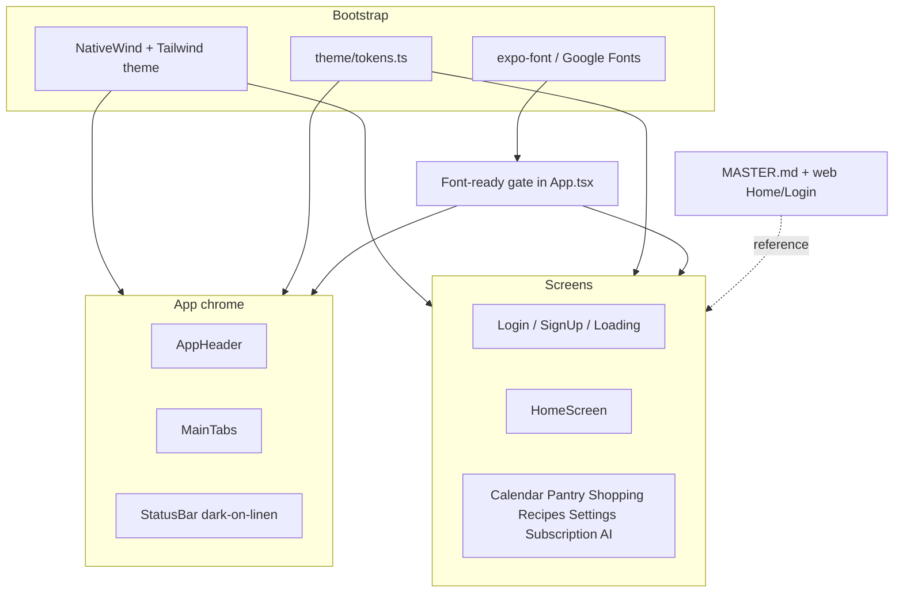

# Technical Design: Mobile Warm Kitchen Design Alignment

**Feature reference:** [mobile-warm-kitchen-alignment.md](../features/mobile-warm-kitchen-alignment.md)  
**Status:** Design  
**Scope:** Mobile app (`mobile/`) visual system only  
**Source of truth:** `frontend/design-system/lardermind/MASTER.md`

---

## 1. Overview

Port the Warm Kitchen design system from web/landing into the Expo mobile app so LarderMind reads as one product across surfaces.

### Goals

| Goal | How achieved |
|------|--------------|
| **Token parity** | Extend NativeWind Tailwind theme with the same colors/fonts as `frontend/tailwind.config.js` |
| **Typography parity** | Bundle Fraunces + Source Sans 3 via Expo Google Font packages; gate app paint on font ready |
| **Composition parity** | Restyle chrome + all screens against MASTER.md / web `Home.tsx` / `Login.tsx` patterns |
| **Minimal risk** | Visual-only diffs; no API, auth, or navigation IA changes |
| **Testable** | Keep auth smoke tests green; add lightweight token/font bootstrap coverage if practical |

### Non-goals

- Shared monorepo `packages/design-tokens`
- Dark mode
- Changing mobile tab inventory to match web’s “More” overflow menu
- Pixel-identical CSS hover/focus rings (map to RN press states instead)

---

## 2. Architecture Overview

### 2.1 Current state

```
App.tsx
  ├── global.css          (@tailwind only; no tokens)
  ├── tailwind.config.js  (theme.extend: {})
  ├── MainTabs            (orange active #f97316, white bar)
  ├── AppHeader           (bg-orange-500 primary)
  └── screens/*           (gray/orange/rainbow utility classes + inline hex)
```

Fonts: RN system defaults. Icons: Lucide with hardcoded hex colors.

### 2.2 Target state

```
App.tsx
  ├── useFonts(...)                 [NEW] gate render
  ├── global.css                    tokens + @layer components
  ├── tailwind.config.js            colors + fontFamily
  ├── theme/tokens.ts               [NEW] hex constants for Lucide / calendars / StatusBar
  ├── components/ui/*               [NEW optional] Button, TextField, PageTitle wrappers
  ├── MainTabs                      linen bar, herb/muted tints
  ├── AppHeader                     quiet linen/ink (no orange bar)
  └── screens/*                     Warm Kitchen composition
```



### 2.3 Where this fits

| Layer | Change? |
|-------|---------|
| Backend / API | No |
| Auth / contexts | No (visual only on screens that consume them) |
| Navigation structure | No (same Stack + Tabs + screen names) |
| Styling pipeline | Yes — tokens, fonts, classNames, header/tab theme |
| Design-system docs | Yes — mark mobile aligned in MASTER.md |

---

## 3. Data Models / Schema

**No database or API schema changes.**

In-app “data” is a small theme module:

```ts
// mobile/src/theme/tokens.ts
export const colors = {
  ink: '#1F2420',
  muted: '#5E675F',
  linen: '#F3F0E8',
  surface: '#FAF8F3',
  herb: '#4F6B4A',
  herbDeep: '#3A5238',
  sage: '#D8E0D0',
  line: '#DDD8CC',
  // Non-brand functional only
  danger: '#B42318', // error/destructive text — not an accent
  onHerb: '#FFFFFF',
} as const;
```

Rationale: Lucide `color` props, `ActivityIndicator`, `StatusBar`, and `react-native-calendars` theme objects cannot use Tailwind class strings reliably — they need hex constants that stay in sync with `tailwind.config.js`.

Optional later: generate both from one JSON; **out of scope** for this feature (duplicate constants once, document sync rule).

---

## 4. Interface Design

No HTTP APIs. Core app/module interfaces:

### 4.1 Font bootstrap

```ts
// Usage in App.tsx (conceptual)
const [fontsLoaded, fontError] = useFonts({
  Fraunces_400Regular,
  Fraunces_500Medium,
  Fraunces_600SemiBold,
  Fraunces_700Bold,
  SourceSans3_300Light,
  SourceSans3_400Regular,
  SourceSans3_500Medium,
  SourceSans3_600SemiBold,
  SourceSans3_700Bold,
});

// Proceed when fontsLoaded || fontError (fallback to system)
```

**Packages to add** (Expo 54 compatible):

- `expo-font` (if not already transitive)
- `@expo-google-fonts/fraunces`
- `@expo-google-fonts/source-sans-3`

### 4.2 Tailwind theme extensions

```js
// mobile/tailwind.config.js (extend)
theme: {
  extend: {
    colors: {
      ink: '#1F2420',
      muted: '#5E675F',
      linen: '#F3F0E8',
      surface: '#FAF8F3',
      herb: { DEFAULT: '#4F6B4A', deep: '#3A5238' },
      sage: '#D8E0D0',
      line: '#DDD8CC',
    },
    fontFamily: {
      display: ['Fraunces_600SemiBold', 'Fraunces_400Regular', 'serif'],
      sans: ['SourceSans3_400Regular', 'system-ui', 'sans-serif'],
    },
  },
},
```

Exact PostScript names must match the `@expo-google-fonts/*` export names used in `useFonts`.

### 4.3 Shared UI primitives (preferred approach)

NativeWind `@apply` in `@layer components` is **partially unreliable** on React Native (especially focus rings, hover, pseudo-classes). Design choice:

| Pattern | Implementation |
|---------|----------------|
| Colors / fonts on View/Text/TouchableOpacity | NativeWind classNames (`bg-linen`, `text-ink`, `font-display`) |
| Primary / secondary buttons | Small components: `PrimaryButton`, `SecondaryButton` |
| Text fields | `TextField` wrapping `TextInput` with token borders |
| Page title / subtitle | `PageTitle`, `PageSubtitle` or shared className strings |
| List rows | `ListRow` Pressable with `border-b border-line` |

Web CSS class names (`.btn-primary`) may be mirrored in `global.css` where they work; components are the **guaranteed** RN path.

#### Suggested component signatures

```tsx
type PrimaryButtonProps = {
  label: string;
  onPress: () => void;
  disabled?: boolean;
  loading?: boolean;
  icon?: React.ReactNode;
};

type TextFieldProps = {
  label?: string;
  value: string;
  onChangeText: (t: string) => void;
  // plus standard TextInput props (secureTextEntry, placeholder, etc.)
};

type AppHeaderProps = {
  title: string;
  showBackButton?: boolean;
  onBack?: () => void;
  rightElement?: React.ReactNode;
  onRightPress?: () => void;
  // Remove or deprecate orange "primary" as default brand chrome.
  // Keep a quiet default; optional variant only if a screen truly needs contrast panel.
  variant?: 'quiet' | 'surface'; // default 'quiet'
};
```

### 4.4 Tab bar theme constants

```ts
tabBarActiveTintColor: colors.herb,      // was #f97316
tabBarInactiveTintColor: colors.muted,   // was #6b7280
tabBarStyle: {
  backgroundColor: colors.linen,         // was #ffffff
  borderTopColor: colors.line,           // was #e5e7eb
  // keep existing height / padding unless clipping occurs
}
```

---

## 5. Business Logic Flow (UI composition)

No domain business logic changes. Visual workflows:

### 5.1 App boot

1. `App` mounts → `useFonts` starts loading bundled fonts.
2. While `!fontsLoaded && !fontError` → show `LoadingScreen` (already used for auth loading).
3. On ready → existing `AuthProvider` / navigators unchanged.
4. `StatusBar` style: `dark` (ink on linen).

### 5.2 Auth screens (mirror web `Login.tsx`)

1. Full-screen `bg-linen`.
2. Center column: herb icon badge (optional, matches web) + Fraunces “LarderMind” + muted subtitle.
3. Fields stacked on linen/surface — **no** large white shadowed card wrapping the whole form.
4. Error: sage/herb-deep bordered panel (web pattern) or muted danger text — not orange.
5. Primary CTA: herb button; link to SignUp as secondary text/button.
6. Preserve validation, `secureTextEntry`, and auth context calls exactly.

### 5.3 Home (mirror web `Home.tsx` + MASTER.md)

1. Quiet top affordance: settings icon (muted), **no** orange `AppHeader`.
2. **First viewport:** full-bleed hero image + gradient fade into linen (`from-linen` analog via overlay Views).
3. Brand (Fraunces) → one subtitle line → optional welcome muted line → herb primary CTA “Cook with what I have”.
4. **Below fold:** muted pantry/buy counts as text; secondary destinations as divider list rows (Calendar, Pantry, Shopping, Recipes) — Lucide herb icons, arrow affordance.
5. Remove rainbow stats, action tile grid, inset rounded hero card.

Copy: prefer MASTER / web meaning. Mobile currently hardcodes English; **keep English strings** unless i18n already exists on mobile (it does not today). Use:

- Subtitle: `Plan dinner from what's already in your kitchen`
- CTA: navigate to AI assistant with existing `initialPrompt` behavior

### 5.4 Authenticated list screens

Pattern for Calendar / Pantry / Shopping / Recipes / Settings / Subscription / AI:

1. `bg-linen` root.
2. Quiet header: back when stack-presented; title via Fraunces; no orange bar.
3. Content: surface only for modals/forms; lists use hairline `border-line`.
4. FABs / primary actions → herb.
5. Replace leftover `orange-*`, `gray-50`, rainbow backgrounds, and orange spinner hex with tokens.

### 5.5 Calendar third-party theme

Map `react-native-calendars` `theme` prop:

| Calendar key | Token |
|--------------|-------|
| selected day bg | `herb` |
| today text | `herb` |
| arrow color | `herb` |
| month text | `ink` |
| day text | `ink` |
| text disabled | `muted` |
| calendar background | `linen` or `surface` |

Document any uncured library defaults in the task checklist.

### 5.6 Design-doc / MASTER update

After UI lands: set MASTER.md surfaces to include Mobile.

---

## 6. Screen mapping (implementation checklist seed)

| Surface | Primary reference | Key changes |
|---------|-------------------|-------------|
| `tailwind.config.js` / `global.css` | `frontend/tailwind.config.js`, `frontend/src/index.css` | Tokens + optional CSS vars |
| `theme/tokens.ts` | same hex table | Lucide / StatusBar / calendars |
| `App.tsx` | web `BottomNav.tsx` colors | Font gate; tab colors; StatusBar |
| `AppHeader.tsx` | MASTER app chrome | Quiet header; drop orange default |
| `LoadingScreen.tsx` | web Home loading | linen + herb spinner |
| `LoginScreen.tsx` / `SignUpScreen.tsx` | `Login.tsx` / `SignUp.tsx` | Brand-first linen auth |
| `HomeScreen.tsx` | `Home.tsx` + MASTER | Hero composition; list links |
| Remaining screens + shared components | MASTER anti-patterns | Token swap; reduce cards |
| `app.json` splash | linen | `backgroundColor: #F3F0E8` (optional but recommended) |
| Auth tests | existing assertions | Update only if copy/structure queries break |

---

## 7. Edge Cases & Error Handling

| Case | Handling |
|------|----------|
| Font load error | Proceed with system fonts; colors/layout still Warm Kitchen |
| Font load hang | Expo `useFonts` resolves; if stuck, rely on existing timeout behavior — do not block forever without fallback (`fontError` or timeout → continue) |
| Missing NativeWind class after token add | Restart Metro with cache clear; verify `content` paths include `App.tsx` + `src/**` |
| Long titles | Keep `numberOfLines={1}` |
| Hero image fail | Linen background + brand/CTA still visible |
| Accessibility large text | Avoid fixed-height title bars that clip; allow header to grow slightly |
| Destructive/error | Use `colors.danger` sparingly for messages/delete — never as brand |
| Pressed states | `herb-deep` / `sage` instead of web hover translate when motion is awkward on RN |
| Jest + fonts | Mock `expo-font` / Google font packages in `jest.setup.js` to resolve immediately |

---

## 8. Performance & Security

### Performance

- Bundle **only used weights** listed in §4.1 (no full variable font download at runtime).
- Prefer local font packages over Google CSS `@import` (faster, offline, no launch network dependency).
- Home: keep **one** hero image; do not add decorative image grids.
- Avoid new per-row heavy wrappers; `ListRow` should be a thin `Pressable`.
- No Reanimated requirement for this feature; optional opacity fade is fine if cheap.

### Security / privacy

- No new secrets; no auth storage changes.
- Bundled fonts eliminate runtime dependency on fonts.googleapis.com inside the app binary path.
- Remote Unsplash hero remains HTTPS (pre-existing). Optional follow-up: bundle a local hero asset.

---

## 9. Architectural conflicts & decisions

### Conflict A — Web CSS utilities vs NativeWind RN

**Issue:** `.btn-primary` uses `hover:`, `focus:ring`, `@apply` — not 1:1 on RN.  
**Decision:** Token classes + small RN UI components for buttons/inputs. Mirror CSS in `global.css` only where it helps.  
**Alternative rejected:** Force pure CSS `@layer` parity — brittle on NativeWind 4.

### Conflict B — Mobile tabs vs web BottomNav IA

**Issue:** Web primary nav uses Home / AI / Calendar / Pantry + “More”. Mobile already exposes more bottom tabs.  
**Decision:** **Restyle only** — do not restructure tabs in this feature (requirements: no IA change).

### Conflict C — `AppHeader` variant `primary`

**Issue:** Current API defaults to orange brand bar used widely.  
**Decision:** Change default to quiet linen/ink; update call sites. Deprecate orange variant (remove or keep unused for emergency). Grep all `AppHeader` usages during implementation.

### Conflict D — Duplicate token definitions

**Issue:** Hex in both Tailwind config and `tokens.ts`.  
**Decision:** Accept duplication with a comment “keep in sync with frontend/tailwind.config.js”. Shared package deferred.

### Conflict E — Splash still white

**Issue:** `app.json` splash `backgroundColor: #ffffff` clashes with linen app.  
**Decision:** Update splash (and adaptive icon background if trivial) to `#F3F0E8` as part of chrome alignment.

### Conflict F — Mobile has no i18n

**Issue:** Web uses `react-i18next`; mobile hardcodes English.  
**Decision:** Hardcode MASTER-equivalent English strings on Home/Auth; do not add i18n in this feature.

---

## 10. Testing plan

| Test | Expectation |
|------|-------------|
| `npm test` (mobile) | Auth screen tests pass (update queries if subtitle/CTA copy changes) |
| Manual — Auth | Login/SignUp look linen/herb; login still works |
| Manual — Home | First viewport matches composition rules; CTA opens AI with prompt |
| Manual — Tabs | Active herb on linen; all tabs render |
| Manual — Stack | AI + Subscription headers quiet; back works |
| Manual — Calendar | Selected day herb-ish; no orange chrome |
| Visual grep | No remaining `orange-`, `#f97316`, rainbow stat backgrounds in `mobile/src` + `App.tsx` |

---

## 11. Rollout / rollback

- Single mobile PR (or branch) containing tokens → chrome → screens.
- Rollback = revert PR; no migrations.
- Feature flag not required (pure UI).

---

## 12. Implementation order (for Step 3 task breakdown)

1. Dependencies + font bootstrap + Tailwind tokens + `tokens.ts`
2. `global.css` / UI primitives (`PrimaryButton`, `TextField`, …)
3. `App.tsx` tab bar + StatusBar + splash
4. `AppHeader` + `LoadingScreen`
5. Auth screens
6. `HomeScreen`
7. Remaining screens + shared components
8. Tests + MASTER.md status update

---

## 13. Related files

### Read / reference
- `docs/features/mobile-warm-kitchen-alignment.md`
- `frontend/design-system/lardermind/MASTER.md`
- `frontend/tailwind.config.js`
- `frontend/src/index.css`
- `frontend/src/components/Home.tsx`
- `frontend/src/components/Login.tsx`
- `frontend/src/components/BottomNav.tsx`
- `frontend/src/components/SignUp.tsx`

### Modify / add
- `mobile/package.json`
- `mobile/App.tsx`
- `mobile/app.json`
- `mobile/tailwind.config.js`
- `mobile/global.css`
- `mobile/jest.setup.js`
- `mobile/src/theme/tokens.ts` *(new)*
- `mobile/src/components/ui/*` *(new, thin primitives)*
- `mobile/src/components/AppHeader.tsx`
- `mobile/src/components/AskAiEmptyCta.tsx`
- `mobile/src/components/ChatMessageContent.tsx`
- `mobile/src/components/UnitSelect.tsx`
- `mobile/src/screens/*.tsx` (all feature screens)
- `mobile/src/__tests__/screens/auth-screens.test.tsx`
- `frontend/design-system/lardermind/MASTER.md`

---

## 14. Next step

**Step 3 — Feature Tasks:** break this design into independently completable tasks under `tasks/mobile-warm-kitchen-alignment/` with `progress.md` + checklist and acceptance criteria per task.
