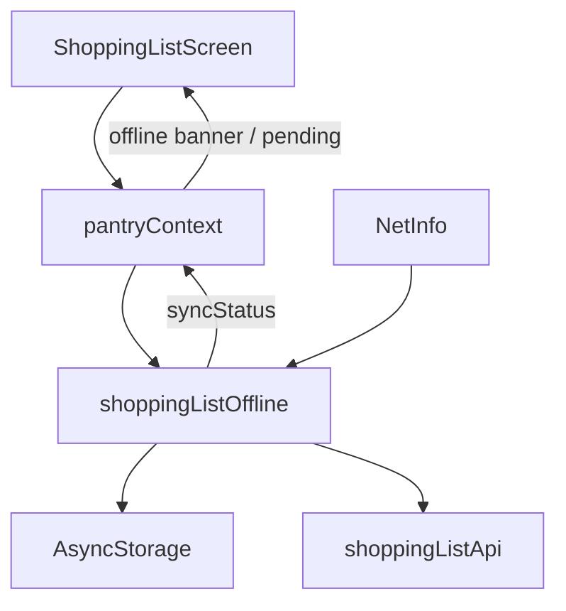

# Technical Design: Offline Shopping List (Mobile)

**Feature reference:** [offline-shopping-list.md](../features/offline-shopping-list.md)  
**Status:** Implemented (mutations must load snapshot before write; Complete All uses single batch — see [mobile-hardening-design](./mobile-hardening-design.md))  

**Scope:** Mobile (`mobile/`) client UX + local cache + background sync  
**Out of scope:** Backend schema/API changes, web offline, multi-device CRDT

---

## 1. Architecture Overview

### 1.1 Where it fits

Offline shopping list sits **between** `ShoppingListScreen` / `pantryContext` and `shoppingListApi`. Persistence and sync are isolated in a small service layer so context stays orchestration-only.

```
ShoppingListScreen
        │
        ▼
pantryContext (shopping list methods)
        │
        ▼
shoppingListOffline/          [NEW]
  ├── store.ts                snapshot + queue AsyncStorage I/O
  ├── queue.ts                coalesce / remap / enqueue
  ├── sync.ts                 flush mutex + backoff
  ├── connectivity.ts         NetInfo wrapper
  └── types.ts
        │
        ├──► shoppingListApi  (existing REST; dual-backend payload)
        └──► AsyncStorage
```



### 1.2 Design decisions (resolves feature §10)

| # | Topic | Decision | Rationale |
|---|--------|----------|-----------|
| 1 | Storage | AsyncStorage, versioned JSON, **user-scoped keys** | Already in app; list size is small |
| 2 | Online writes | **Local-first + unified queue** for all mutations | One path; no double-apply; offline/online identical |
| 3 | Connectivity | `@react-native-community/netinfo` via `npx expo install` | Official Expo SDK 54 companion |
| 4 | Temp ids | `local_` + UUID v4 | Easy to detect; never collide with server UUIDs |
| 5 | Retry UX | Secondary **Retry sync** only when `syncError` and queue non-empty | Auto-sync remains primary |
| 6 | Spring vs Nest payload | Send **flat fields + nested `details`** | Client-only dual compatibility (see §3.3) |

### 1.3 Architectural conflict (raised + resolved)

| Conflict | Impact | Resolution |
|----------|--------|------------|
| Spring create/update expect `{ name, details:{ quantity, unit, checked } }`; Nest DTOs expect **flat** `{ name, quantity, unit, checked }` | Current mobile `toRequestPayload` is Spring-shaped → Nest may ignore qty/unit/checked | Expand payload to include **both** shapes (no backend change) |
| Nest `ShoppingListItemDto` list items may omit display `name` (ingredient_id only) | Offline UI needs names | On hydrate from server, **merge name** from previous cache / ingredients catalog by `ingredient_id` or `id`; local creates always store `name` |

No new sync endpoints. No Prisma/JPA changes.

---

## 2. Data Models / Schema

### 2.1 Storage keys

```
@lardermind/shopping-list/v1/{userId}/snapshot
@lardermind/shopping-list/v1/{userId}/queue
```

- `userId` = `auth.user.id` (required). If missing, do not read/write offline store.
- On logout / user switch: delete both keys for the previous user (and clear in-memory state).

### 2.2 Snapshot

```ts
type ShoppingListSnapshotV1 = {
  version: 1;
  updatedAt: number; // ms epoch, last local write
  items: ShoppingListItem[]; // same shape as mobile/src/types.ts
};
```

### 2.3 Mutation queue

```ts
type MutationType = 'CREATE' | 'UPDATE' | 'DELETE';

type ShoppingListMutationV1 = {
  opId: string;           // uuid — stable for logging/tests
  type: MutationType;
  itemId: string;         // server uuid OR local_* temp id
  payload?: {
    name?: string;
    quantity?: number;
    unit?: string;
    checked?: boolean;
  };
  createdAt: number;
};

type ShoppingListQueueV1 = {
  version: 1;
  mutations: ShoppingListMutationV1[];
};
```

### 2.4 In-memory sync status (context)

```ts
type ShoppingListSyncStatus = {
  isOnline: boolean;
  pendingCount: number;
  isSyncing: boolean;
  lastSyncError: string | null;
  lastSyncedAt: number | null;
};
```

Exposed via `pantryContext` (or a thin `useShoppingListSync()` hook reading the same store) for the screen banner.

---

## 3. Interface Design

### 3.1 New module API (`mobile/src/services/shoppingListOffline/`)

```ts
// store.ts
loadSnapshot(userId: string): Promise<ShoppingListItem[]>;
saveSnapshot(userId: string, items: ShoppingListItem[]): Promise<void>;
loadQueue(userId: string): Promise<ShoppingListMutationV1[]>;
saveQueue(userId: string, mutations: ShoppingListMutationV1[]): Promise<void>;
clearUserOfflineData(userId: string): Promise<void>;

// queue.ts
coalesce(mutations: ShoppingListMutationV1[]): ShoppingListMutationV1[];
enqueueCreate(...): ShoppingListMutationV1[];
enqueueUpdate(...): ShoppingListMutationV1[];
enqueueDelete(...): ShoppingListMutationV1[];
remapItemId(mutations, fromId, toId): ShoppingListMutationV1[];

// sync.ts
flushShoppingListQueue(userId: string, opts?: { reason: string }): Promise<FlushResult>;
// FlushResult: { ok: boolean; error?: string; remaining: number }

// connectivity.ts
subscribeConnectivity(onChange: (online: boolean) => void): () => void;
getIsOnline(): Promise<boolean>;
```

Pure coalesce/remap functions must be unit-tested without AsyncStorage.

### 3.2 Context method contracts (behavior change)

Existing signatures stay; semantics become local-first:

| Method | Behavior |
|--------|----------|
| `fetchAllShoppingListItems` | 1) hydrate from snapshot → setState; 2) if online, GET list → merge names → setState + save snapshot; 3) if offline/network fail, keep snapshot |
| `addShoppingListItem` | Local temp id → prepend state → save snapshot → enqueue CREATE → `maybeFlush()` |
| `updateShoppingListItem` | Patch state → save snapshot → enqueue UPDATE → `maybeFlush()` |
| `removeShoppingListItem` | Filter state → save snapshot → enqueue DELETE (or drop CREATE) → `maybeFlush()` |
| `clearShoppingListOfflineOnLogout` | **New** — called from `authContext.logout` |

Return type: continue returning `ApiResponse`-like results. For queued offline ops, return `{ success: true, data: localItem }` (optimistic success) so UI toasts do not show network failure.

### 3.3 Dual-backend request payload

Update `mobile/src/api/shoppingList.ts` `toRequestPayload`:

```ts
{
  name: data.name,
  quantity: data.quantity,
  unit: data.unit,
  checked: data.checked ?? false,
  details: {
    quantity: data.quantity,
    unit: data.unit,
    checked: data.checked ?? false,
  },
}
```

| Backend | Why it works |
|---------|----------------|
| Spring create | Reads `name` + `details` map |
| Spring update | Merges `details` + top-level `quantity/unit/checked` |
| Nest create/update | class-validator binds flat fields |

Response parsing: keep `fromDto` / `parseShoppingListItems` (already supports array, `{ items }`, and `details` nesting).

### 3.4 Existing REST (unchanged)

Flush maps to:

| Queue op | HTTP |
|----------|------|
| CREATE | `POST /api/shopping-list` |
| UPDATE | `PUT /api/shopping-list/:id` |
| DELETE | `DELETE /api/shopping-list/:id` |

No bulk-sync endpoint. Complete-all = N local updates coalesced per item (one UPDATE each).

---

## 4. Business Logic Flow

### 4.1 Boot / screen mount

```mermaid
sequenceDiagram
  participant S as ShoppingListScreen
  participant C as pantryContext
  participant O as offline store
  participant A as shoppingListApi

  S->>C: fetchAllShoppingListItems()
  C->>O: loadSnapshot(userId)
  O-->>C: cached items
  C->>C: setShoppingList(cached)
  C->>O: loadQueue → pendingCount
  alt online
    C->>A: GET shopping-list
    A-->>C: items
    C->>C: mergeNames(cached, server)
    C->>O: saveSnapshot
    C->>C: maybeFlush()
  else offline / network error
    C->>C: keep cached; isOnline=false
  end
```

### 4.2 Mutation (online or offline)

1. Apply to React state immediately.
2. `saveSnapshot`.
3. Append mutation; `coalesce`; `saveQueue`.
4. Update `pendingCount`.
5. `maybeFlush()` if `isOnline` and not already syncing.

### 4.3 Coalesce rules

Apply in order when saving queue:

1. **CREATE then DELETE same `itemId`** → remove both.
2. **DELETE then any later op on same id** → keep DELETE only (drop later updates); if DELETE follows CREATE that was already collapsed, nothing left.
3. **Multiple UPDATE same `itemId`** → keep **last** UPDATE; merge payload fields (last write wins per field by replacing whole payload with latest).
4. **UPDATE after CREATE (temp id)** → fold UPDATE fields into CREATE payload; drop UPDATE.
5. Preserve relative order of distinct itemIds (FIFO by first remaining op).

### 4.4 Flush algorithm

```
acquire mutex (single flusher)
if !online or !jwt → exit
while queue not empty:
  op = queue[0]
  try:
    if CREATE:
      res = POST(payload)
      if success:
        remap local id → server id in state, snapshot, rest of queue
        shift queue
      else handleFailure(op, res)
    if UPDATE:
      if itemId starts with local_:
        // should have been folded into CREATE; if orphaned, skip/drop
      res = PUT(itemId, payload)
      ...
    if DELETE:
      res = DELETE(itemId)
      on 404: treat as success (already gone); shift
  on network error: save queue; set lastSyncError; break (retry later)
  on 401: set lastSyncError; break (keep queue)
  on other 4xx/5xx: set lastSyncError; break (keep op at head; allow Retry)
after successful full or partial progress:
  if queue empty: GET list → replace snapshot (source of truth)
  clear lastSyncError if queue empty
release mutex
```

**Backoff:** on network failure, schedule retry at 2s, 5s, 15s (cap); reset on connectivity `online` event (debounced 500ms).

### 4.5 Connectivity

- Subscribe once at `PantryProvider` mount (or app root after auth).
- Debounce `true` transitions 500ms before flush.
- Treat NetInfo `isConnected === true && isInternetReachable !== false` as online; if `isInternetReachable == null`, fall back to `isConnected`.

### 4.6 Logout

`authContext.logout`:

1. Read current `user.id`.
2. Call `clearUserOfflineData(userId)`.
3. Existing JWT/user clear.
4. Pantry context resets `shoppingList` to `[]` and sync status defaults.

### 4.7 UI

`ShoppingListScreen`:

- Banner row under header:
  - Offline: “You’re offline — changes save on this device”
  - Pending/syncing: “Syncing N changes…” / “N changes waiting”
  - Error: message + **Retry sync** button → `flushShoppingListQueue`
- Wire Trash → `removeShoppingListItem(item.id)`.
- Complete-all: local map all unchecked → checked, then one enqueue UPDATE per id (coalesce handles duplicates).

---

## 5. Edge Cases & Error Handling

| Case | Handling |
|------|----------|
| Empty snapshot, offline | Empty list + offline empty copy |
| App kill mid-queue | Queue durable; flush on next online |
| CREATE+DELETE before sync | Coalesce removes both |
| Temp id after CREATE success | Remap state/snapshot/queue; FlatList `keyExtractor` updates |
| 404 on UPDATE/DELETE | Drop op; continue; final GET reconciles |
| 401 | Stop flush; keep queue; surface auth error (existing session UX) |
| Nest list without names | `mergeNames(prev, server)` by id / ingredient_id |
| Rapid qty taps | Coalesce to one UPDATE |
| Flush re-entry | Mutex no-op second caller |
| User switch without logout race | Keys include userId; always pass active userId into store |
| Online but API base wrong | Network/HTTP errors keep queue; user can Retry |

Validation: client-side same as today (non-empty name on add; qty ≥ 0). Server validation failures leave op at head with error message.

---

## 6. Performance & Security

### 6.1 Performance

| Concern | Approach |
|---------|----------|
| Storage churn | Debounce snapshot writes ~150ms on rapid qty changes; queue write coalesced with same tick |
| Sync storm | Single mutex; debounced online; exponential backoff |
| UI thread | Flush async; state updates batched where possible |
| Snapshot size | Full list OK (typically ≪ 100 items) |
| Complete-all | Local O(n) state update; queue n UPDATEs → coalesce still n distinct ids |

### 6.2 Security

| Concern | Approach |
|---------|----------|
| Cross-user leak | User-scoped keys + clear on logout |
| Tampered cache | Display-only until sync; server authoritative after flush |
| JWT | Flush no-ops without token; 401 keeps queue |
| Logs | Log op types/ids only, not full shopping contents in production builds |

---

## 7. File change plan

| Action | Path |
|--------|------|
| Add | `mobile/src/services/shoppingListOffline/types.ts` |
| Add | `mobile/src/services/shoppingListOffline/store.ts` |
| Add | `mobile/src/services/shoppingListOffline/queue.ts` |
| Add | `mobile/src/services/shoppingListOffline/sync.ts` |
| Add | `mobile/src/services/shoppingListOffline/connectivity.ts` |
| Add | `mobile/src/services/shoppingListOffline/index.ts` |
| Add | `mobile/src/__tests__/shoppingListOffline/*.test.ts` (coalesce, remap, mergeNames) |
| Modify | `mobile/package.json` — `@react-native-community/netinfo` |
| Modify | `mobile/src/api/shoppingList.ts` — dual payload |
| Modify | `mobile/src/contexts/pantryContext.tsx` — local-first shopping methods + sync status |
| Modify | `mobile/src/contexts/authContext.tsx` — clear offline data on logout |
| Modify | `mobile/src/screens/ShoppingListScreen.tsx` — banner, delete wire, retry |
| Modify | `mobile/src/types.ts` — optional `ShoppingListSyncStatus` export |

No backend file changes required for v1.

---

## 8. Testing strategy

| Layer | Cases |
|-------|-------|
| Unit `queue.ts` | coalesce CREATE+DELETE; multi UPDATE; UPDATE folds into CREATE; remap |
| Unit `store.ts` | round-trip snapshot/queue; clearUser |
| Unit `sync.ts` | mock API: flush order; temp id remap; 404 drop; network abort leaves head |
| Unit payload | `toRequestPayload` includes flat + details |
| Component | banner states; delete calls remove; offline add appears without mock network |
| Manual | Airplane mode A–E; reconnect auto-sync; Spring base URL + Nest base URL smoke |

---

## 9. Risks & follow-ups

| Risk | Mitigation / follow-up |
|------|------------------------|
| Nest responses still thin on `name` | mergeNames; longer-term Nest DTO enrichment (out of this feature) |
| Dual payload might confuse future strict validators | Document in API client; prefer contract tests |
| Multi-device edits while offline | Explicit non-goal; last flush wins |
| Auth logout forgets clear | Checklist + test that keys are removed |

---

## 10. Acceptance mapping

| Feature AC | Design coverage |
|------------|-----------------|
| Offline see last list | §4.1 snapshot hydrate |
| Offline A–E + persist | §4.2 + durable queue/snapshot |
| Complete all offline | §4.7 |
| Auto background sync | §4.4–4.5 |
| Server matches after sync | final GET replace |
| Status UX | §4.7 + sync status |
| Logout clears | §4.6 |
| Spring + Nest | §3.3 dual payload |
| No new backend APIs | §1 / §3.4 |
| Tests | §8 |
